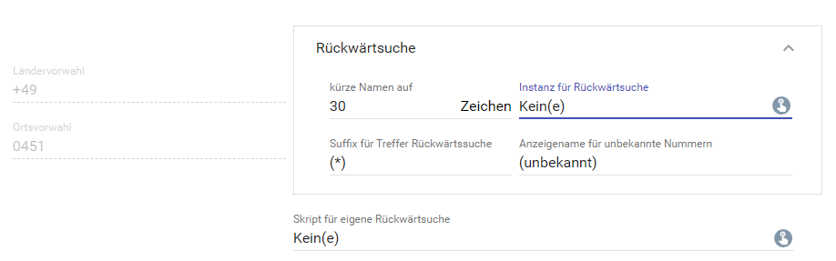

  

   

  

# FritzBox Callmonitor <!-- omit in toc -->
Anrufmonitor welcher ankommenden und abgehenden Anrufen erkennt.  

### Inhaltsverzeichnis <!-- omit in toc -->

- [1. Funktionsumfang](#1-funktionsumfang)
- [2. Voraussetzungen](#2-voraussetzungen)
- [3. Software-Installation](#3-software-installation)
- [4. Einrichten der Instanzen in IP-Symcon](#4-einrichten-der-instanzen-in-ip-symcon)
- [5. Statusvariablen und Profile](#5-statusvariablen-und-profile)
  - [Statusvariablen](#statusvariablen)
  - [Profile](#profile)
- [6. WebFront](#6-webfront)
- [7. PHP-Funktionsreferenz](#7-php-funktionsreferenz)
- [8. Aktionen](#8-aktionen)
- [9. Anhang](#9-anhang)
  - [1. Changelog](#1-changelog)
  - [2. Spenden](#2-spenden)
- [10. Lizenz](#10-lizenz)

## 1. Funktionsumfang

* Auswertung von ankommenden und abgehenden Anrufen.
* Erkennung der Gesprächspartner, sofern im Telefonbuch vorhanden.
* Zusätzliche Rückwertssuche über externe Instanz (Modul `Rückwärtssuche`) oder individuellen Script möglich.
* Senden von Benachrichtigungen an das WebFront.
* Ausführen von Aktionen.
* Darstellung der aktiven Gespräche als HTML-Tabelle.

## 2. Voraussetzungen

- IP-Symcon ab Version 6.0
- Aktivierter Callmonitor in der FritzBox (per Telefon #96*5* wählen zum aktivieren)

## 3. Software-Installation

* Über den Module Store das `FritzBox`-Modul installieren.

## 4. Einrichten der Instanzen in IP-Symcon

 Es wird empfohlen Instanzen über die entsprechenden [FritzBox Konfigurator](../FritzBox%20Configurator/README.md)-Instanz zu erzeugen.  
 
 Unter 'Instanz hinzufügen' ist das 'FritzBox Callmonitor'-Modul unter dem Hersteller 'AVM' aufgeführt.

Durch das hinzufügen dieser Instanz wird die entsprechende [FritzBox IO](../FritzBox%20IO/README.md)-Instanz automatisch eine eigene Client-Socket Instanz erzeugen, welche benötigt wird um die Ereignisse der FritzBox zu empfangen.  

----
__Konfigurationsseite__:  

Die Vorwahlen werden automatisch aus der FritzBox ausgelesen; im Fehlerfall wird eine Meldung erzeugt und die Eingabe muss manuell erfolgen.  
Sind Einstellungen ausgegraut, so sind die Voraussetzungen nicht erfüllt um diese Einstellungen nutzen zu können.
Zum Beispiel das Konfigurieren der HTML-Tabelle, wen die Tabelle deaktiviert wurde.  

---  
Konfiguration Rückwärtssuche:  

---
Konfiguration der Benachrichtigungen (WebFront):  

---
Konfiguration der HTML Tabelle:  

__Konfigurationsparameter__: 
| Name                    | Typ            | Beschreibung                                                                             |
| ----------------------- | -------------- | ---------------------------------------------------------------------------------------- |
| AreaCode                | string         | Ortsvorwahl                                                                              |
| CountryCode             | string         | Ländervorwahl                                                                            |
| ReverseSearchInstanceID | integer        | InstanzID einer Rückwärtssuche-Instanz                                                   |
| CustomSearchScriptID    | integer        | ObjectID eines eigenen Skriptes für individuelle Rückwärtssuche                          |
| MaxNameSize             | integer        | Einkürzen von Namen der Gesprächspartner auf MaxNameSize Zeichen                         |
| SearchMarker            | string         | Marker welche dem Namen vorangestellt wird, wenn der Name aus einer Rückwärtssuche kommt |
| UnknownNumberName       | string         | Zeichenkette welche angezeigt wird, wenn kein Name bekannt ist                           |
| NotShowWarning          | boolean        | Warnmeldung abschalten, wenn das Rückwärtssuche Modul nicht installiert ist              |
| CallsAsTable            | boolean        | Ausgabe der Gespräche als HTML-Tabelle in einer String-Variable                          |
| CallsAsNotification     | boolean        | Änderungen von Anrufen/Gesprächen als Benachrichtigung an WebFront senden                |
| Targets                 | string / Liste | WebFronts welche eine Benachrichtigung erhalten sollen                                   |
| Notification            | string / Liste | Konfiguration der Benachrichtigungen (Titel, Inhalt, Icon, Timeout)                      |
| Actions                 | string / Liste | Liste von Aktionen welche bei Ereignissen ausgeführt werden sollen                       |
| Table                   | string / Liste | HTML/CSS Konfiguration der HTML-Tabelle                                                  |
| Columns                 | string / Liste | HTML/CSS Konfiguration der Spalten (pro Spalte)                                          |
| Rows                    | string / Liste | HTML/CSS Konfiguration der Zeilen (Überschrift, gerade und ungerade)                     |
| Icons                   | string / Liste | Icon für jedes Ereignis, wird in der Spalte Icon in der HTML Tabelle angezeigt           |

## 5. Statusvariablen und Profile

Die Statusvariablen werden automatisch angelegt. Das Löschen einzelner kann zu Fehlfunktionen führen.

### Statusvariablen
| Ident    | Name             | Typ    | Beschreibung                       |
| -------- | ---------------- | ------ | ---------------------------------- |
| CallList | Aktive Gespräche | string | HTML Tabelle der aktiven Gespräche |

### Profile

Dieses Modul erzeugt keine Variablenprofile.  

## 6. WebFront

## 7. PHP-Funktionsreferenz

Keine Funktionen verfügbar. 

## 8. Aktionen

Keine Aktionen verfügbar.

## 9. Anhang

### 1. Changelog

[Changelog der Library](../README.md#changelog)

### 2. Spenden

  Die Library ist für die nicht kommerzielle Nutzung kostenlos, Schenkungen als Unterstützung für den Autor werden hier akzeptiert:  

  

 

## 10. Lizenz

  IPS-Modul:  
  [CC BY-NC-SA 4.0](https://creativecommons.org/licenses/by-nc-sa/4.0/)  

