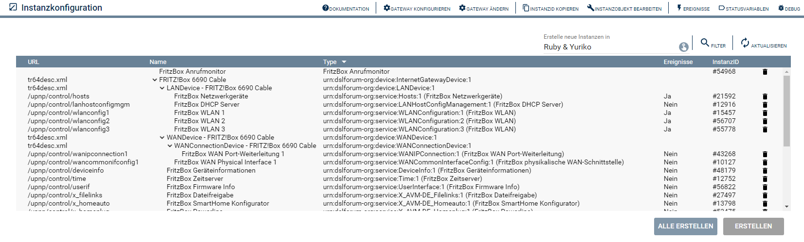

  

   

  

# FritzBox Konfigurator <!-- omit in toc -->
Konfigurator zum Anlegen von weiteren Instanzen.  

### Inhaltsverzeichnis <!-- omit in toc -->

- [1. Funktionsumfang](#1-funktionsumfang)
- [2. Voraussetzungen](#2-voraussetzungen)
- [3. Software-Installation](#3-software-installation)
- [4. Einrichten der Instanzen in IP-Symcon](#4-einrichten-der-instanzen-in-ip-symcon)
- [5. Statusvariablen und Profile](#5-statusvariablen-und-profile)
  - [Statusvariablen](#statusvariablen)
  - [Profile](#profile)
- [6. WebFront](#6-webfront)
- [7. PHP-Funktionsreferenz](#7-php-funktionsreferenz)
- [8. Aktionen](#8-aktionen)
- [9. Anhang](#9-anhang)
  - [1. Changelog](#1-changelog)
  - [2. Spenden](#2-spenden)
- [10. Lizenz](#10-lizenz)

## 1. Funktionsumfang

* Ermittelt alle Dienste der FritzBox.
* Ermöglicht das anlegen von Instanzen für unterstützte Dienste.

## 2. Voraussetzungen

- IP-Symcon ab Version 6.0

## 3. Software-Installation

* Über den Module Store das `FritzBox`-Modul installieren.

## 4. Einrichten der Instanzen in IP-Symcon

 Es wird empfohlen die Konfigurator-Instanz über die entsprechenden [FritzBox Discovery](../FritzBox%20Discovery/README.md)-Instanz zu erzeugen.  
 
 Unter 'Instanz hinzufügen' ist das 'FritzBox Konfigurator'-Modul unter dem Hersteller 'AVM' aufgeführt.

__Konfigurationsseite__:

Ermöglicht das auswählen bestimmter Services der FritzBox um dann die jeweilig passende Instanz zu erstellen.  

  

## 5. Statusvariablen und Profile

### Statusvariablen

Dieses Modul erzeugt keine Statusvariablen.  

### Profile

Dieses Modul erzeugt keine Variablenprofile.  

## 6. WebFront

Dieses Modul ist nicht zur Darstellung im WebFront gedacht.

## 7. PHP-Funktionsreferenz

Keine Funktionen verfügbar. 

## 8. Aktionen

Keine Aktionen verfügbar.

## 9. Anhang

### 1. Changelog

[Changelog der Library](../README.md#changelog)

### 2. Spenden

  Die Library ist für die nicht kommerzielle Nutzung kostenlos, Schenkungen als Unterstützung für den Autor werden hier akzeptiert:  

  

 

## 10. Lizenz

  IPS-Modul:  
  [CC BY-NC-SA 4.0](https://creativecommons.org/licenses/by-nc-sa/4.0/)  

