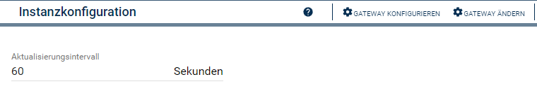
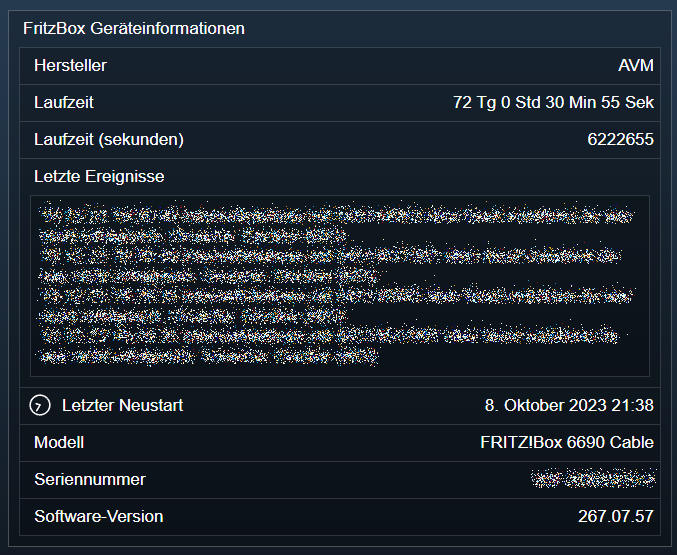

[](https://www.symcon.de/service/dokumentation/entwicklerbereich/sdk-tools/sdk-php/)
[](https://community.symcon.de/t/modul-fritzbox-ersatz-fuer-fritzbox-project/125451)
[](https://www.symcon.de/de/service/dokumentation/installation/migrationen/v70-v71-q1-2024/)  
[](https://creativecommons.org/licenses/by-nc-sa/4.0/)
[](https://github.com/Nall-chan/FritzBox/actions)
[](https://github.com/Nall-chan/FritzBox/actions)  
[](#2-spenden)
[](#2-spenden)  

# FritzBox Geräte Informationen <!-- omit in toc -->

Allgemeine Geräte Informationen abrufen.  

## Inhaltsverzeichnis <!-- omit in toc -->

- [1. Funktionsumfang](#1-funktionsumfang)
- [2. Voraussetzungen](#2-voraussetzungen)
- [3. Software-Installation](#3-software-installation)
- [4. Einrichten der Instanzen in IP-Symcon](#4-einrichten-der-instanzen-in-ip-symcon)
- [5. Statusvariablen und Profile](#5-statusvariablen-und-profile)
  - [Statusvariablen](#statusvariablen)
  - [Profile](#profile)
- [6. Visualisierung](#6-visualisierung)
- [7. PHP-Funktionsreferenz](#7-php-funktionsreferenz)
- [8. Aktionen](#8-aktionen)
- [9. Anhang](#9-anhang)
  - [1. Changelog](#1-changelog)
  - [2. Spenden](#2-spenden)
- [10. Lizenz](#10-lizenz)

## 1. Funktionsumfang

- Auslesen und abbilden allgemeiner Informationen zur FritzBox in Symcon Variablen.
- Alte Variablen vom FB-Project sind **nicht** kompatibel.

## 2. Voraussetzungen

- Symcon ab Version 7.1

## 3. Software-Installation

- Über den Module Store das `FritzBox`-Modul installieren.

## 4. Einrichten der Instanzen in IP-Symcon

Es wird empfohlen Instanzen über die entsprechenden [FritzBox Konfigurator](../FritzBox%20Configurator/README.md)-Instanz zu erzeugen.  

Unter 'Instanz hinzufügen' ist das 'FritzBox Geräte Informationen'-Modul unter dem Hersteller 'AVM' aufgeführt.

**Konfigurationsseite**:  



**Konfigurationsparameter**:  

| Name            | Typ     | Beschreibung                         |
| --------------- | ------- | ------------------------------------ |
| RefreshInterval | integer | Aktualisierungsintervall in Sekunden |

## 5. Statusvariablen und Profile

Die Statusvariablen werden automatisch angelegt. Das Löschen einzelner kann zu Fehlfunktionen führen.

### Statusvariablen

| Ident           | Name                | Typ     | Beschreibung                       |
| --------------- | ------------------- | ------- | ---------------------------------- |
| Manufacturer    | Hersteller          | string  | Herstellername                     |
| Model           | Modell              | string  | Modell                             |
| SerialNumber    | Seriennummer        | string  | Seriennummer des Gerätes           |
| SoftwareVersion | Software-Version    | string  | Software Version                   |
| LastReboot      | Letzter Neustart    | integer | UnixtimeStamp vom letzten Neustart |
| RunTimeRAW      | Laufzeit (sekunden) | integer | Laufzeit in Sekunden seit Neustart |
| Runtime         | Laufzeit            | string  | Laufzeit als Klartext              |
| DeviceLog       | Letzte Ereignisse   | string  | Die letzten Ereignisse             |

### Profile

Dieses Modul erzeugt keine Variablenprofile.  

## 6. Visualisierung



## 7. PHP-Funktionsreferenz

```php
array|false FB_GetInfo(integer $InstanceID);
```  

Beispiel:  

```php
$Result = FB_GetInfo(12345);
var_dump($Result);
```  

Ausgabe:  

```php
array(12) {
  ["NewManufacturerName"]=>
  string(3) "AVM"
  ["NewManufacturerOUI"]=>
  string(6) "00040E"
  ["NewModelName"]=>
  string(20) "FRITZ!Box 6690 Cable"
  ["NewDescription"]=>
  string(38) "FRITZ!Box 6690 Cable Release 267.07.57"
  ["NewProductClass"]=>
  string(9) "FRITZ!Box"
  ["NewSerialNumber"]=>
  string(12) "XXXXXXXXXXXX"
  ["NewSoftwareVersion"]=>
  string(9) "267.07.57"
  ["NewHardwareVersion"]=>
  string(20) "FRITZ!Box 6690 Cable"
  ["NewSpecVersion"]=>
  string(3) "1.0"
  ["NewProvisioningCode"]=>
  string(13) "AXConfigured!"
  ["NewUpTime"]=>
  string(7) "6221779"
  ["NewDeviceLog"]=>
  string() "19.12.23 19:30:49 Internettelefonie mit ....
}

```

## 8. Aktionen

Keine Aktionen verfügbar.

## 9. Anhang

### 1. Changelog

[Changelog der Library](../README.md#changelog)

### 2. Spenden

Die Library ist für die nicht kommerzielle Nutzung kostenlos, Schenkungen als Unterstützung für den Autor werden hier akzeptiert:  

[](https://paypal.me/Nall4chan)  

[](https://www.amazon.de/hz/wishlist/ls/YU4AI9AQT9F?ref_=wl_share)  

## 10. Lizenz

  IPS-Modul:  
  [CC BY-NC-SA 4.0](https://creativecommons.org/licenses/by-nc-sa/4.0/)  
