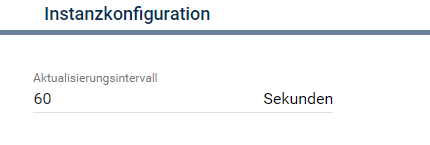
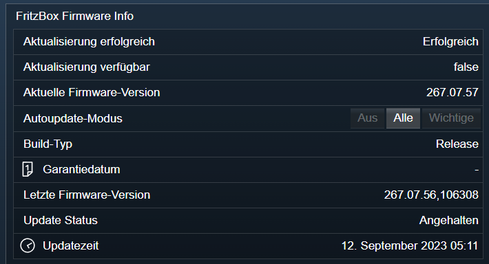

[](https://www.symcon.de/service/dokumentation/entwicklerbereich/sdk-tools/sdk-php/)
[]()
[](https://www.symcon.de/de/service/dokumentation/installation/migrationen/v70-v71-q1-2024/)  
[](https://creativecommons.org/licenses/by-nc-sa/4.0/)
[](https://github.com/Nall-chan/FritzBox/actions)
[](https://github.com/Nall-chan/FritzBox/actions)  
[](#2-spenden)
[](#2-spenden)  

# FritzBox Firmware Informationen <!-- omit in toc -->
Auslesen von Informationen zur Firmware der FritzBox.  

### Inhaltsverzeichnis <!-- omit in toc -->

- [1. Funktionsumfang](#1-funktionsumfang)
- [2. Voraussetzungen](#2-voraussetzungen)
- [3. Software-Installation](#3-software-installation)
- [4. Einrichten der Instanzen in IP-Symcon](#4-einrichten-der-instanzen-in-ip-symcon)
- [5. Statusvariablen und Profile](#5-statusvariablen-und-profile)
  - [Statusvariablen](#statusvariablen)
  - [Profile](#profile)
- [6. WebFront](#6-webfront)
- [7. PHP-Funktionsreferenz](#7-php-funktionsreferenz)
- [8. Aktionen](#8-aktionen)
- [9. Anhang](#9-anhang)
  - [1. Changelog](#1-changelog)
  - [2. Spenden](#2-spenden)
- [10. Lizenz](#10-lizenz)

## 1. Funktionsumfang

* Auslesen von Informationen zur Firmware.  
* Umschalten des Update-Kanals.  
* Alte Variablen vom FB-Project sind **nicht** kompatibel.  

## 2. Voraussetzungen

- Symcon ab Version 7.1

## 3. Software-Installation

* Über den Module Store das `FritzBox`-Modul installieren.


## 4. Einrichten der Instanzen in IP-Symcon
 
 Es wird empfohlen Instanzen über die entsprechenden [FritzBox Konfigurator](../FritzBox%20Configurator/README.md)-Instanz zu erzeugen.  

 Unter 'Instanz hinzufügen' ist das 'FritzBox Firmware Informationen'-Modul unter dem Hersteller 'AVM' aufgeführt.

__Konfigurationsseite__:

  

__Konfigurationsparameter__:  

| Name            | Typ     | Beschreibung                         |
| --------------- | ------- | ------------------------------------ |
| RefreshInterval | integer | Aktualisierungsintervall in Sekunden |

## 5. Statusvariablen und Profile

Die Statusvariablen werden automatisch angelegt. Das Löschen einzelner kann zu Fehlfunktionen führen.

### Statusvariablen

| Ident            | Name                       | Typ     | Beschreibung                          |
| ---------------- | -------------------------- | ------- | ------------------------------------- |
| AutoUpdateMode   | Autoupdate-Modus           | string  | Gewählter Modus für Updates           |
| BuildType        | Build-Typ                  | string  | Build-Typ der installierten Firmware  |
| WarrantyDate     | Garantiedatum              | integer | Garantiedatum als UnixtimeStamp       |
| CurrentFwVersion | Aktuelle Firmware-Version  | string  | Installierte Firmware-Version         |
| LastFwVersion    | Letzte Firmware-Version    | string  | Verfügbare Firmware-Version           |
| UpgradeAvailable | Aktualisierung verfügbar   | boolean | true wenn neue Version installierbar  |
| UpdateSuccessful | Aktualisierung erfolgreich | string  | Ergebnis der letzten Aktualisierung   |
| UpdateState      | Update Status              | string  | Status einer laufenden Aktualisierung |
| UpdateTime       | Updatezeit                 | integer | Zeitpunkt der letzten Installation    |


### Profile

| Name                | Typ    |
| ------------------- | ------ |
| FB.UpdateState      | string |
| FB.BuildType        | string |
| FB.AutoUpdateMode   | string |
| FB.UpdateSuccessful | string |


## 6. WebFront

  

## 7. PHP-Funktionsreferenz

```php
array|false FB_GetInfo(integer $InstanceID);
array|false FB_GetInfoEx(integer $InstanceID);
boolean FB_SetAutoUpdateMode(integer $InstanceID, string $Mode);
array|false FB_GetInternationalConfig(integer $InstanceID);
boolean FB_CheckUpdate(integer $InstanceID);
boolean FB_DoUpdate(integer $InstanceID);
```

## 8. Aktionen

Keine Aktionen verfügbar.

## 9. Anhang

### 1. Changelog

[Changelog der Library](../README.md#changelog)

### 2. Spenden

  Die Library ist für die nicht kommerzielle Nutzung kostenlos, Schenkungen als Unterstützung für den Autor werden hier akzeptiert:  

[](https://paypal.me/Nall4chan)  

[](https://www.amazon.de/hz/wishlist/ls/YU4AI9AQT9F?ref_=wl_share) 

## 10. Lizenz

  IPS-Modul:  
  [CC BY-NC-SA 4.0](https://creativecommons.org/licenses/by-nc-sa/4.0/)  

