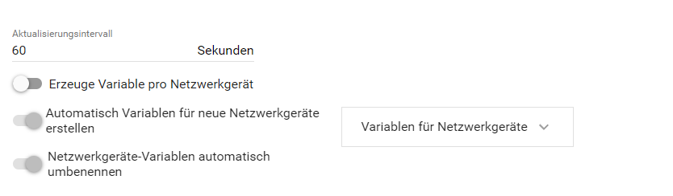
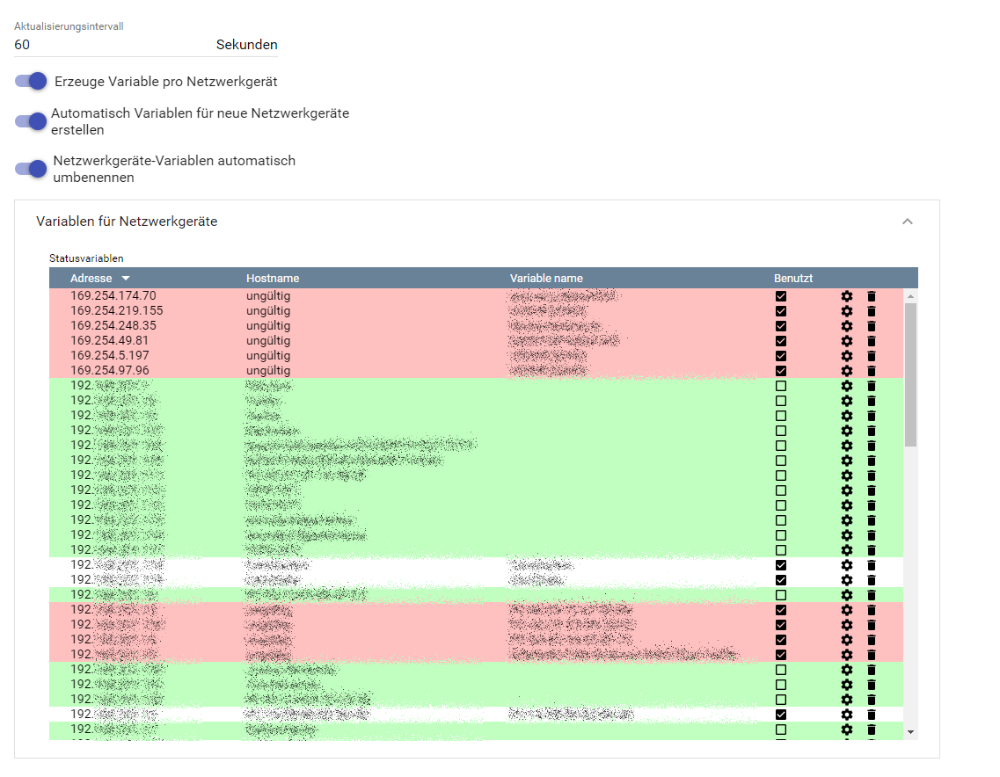
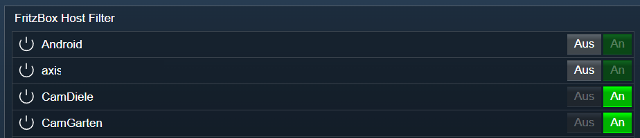

[](https://www.symcon.de/service/dokumentation/entwicklerbereich/sdk-tools/sdk-php/)
[]()
[](https://community.symcon.de/t/ip-symcon-6-0-testing/44478)  
[](https://creativecommons.org/licenses/by-nc-sa/4.0/)
[](https://github.com/Nall-chan/FritzBox/actions) [](https://github.com/Nall-chan/FritzBox/actions)  
[](#2-spenden)
[](#2-spenden)  

# FritzBox Host Filter <!-- omit in toc -->
Abfragen und Steuern des Zugangs von Clients zum Internet.  

### Inhaltsverzeichnis <!-- omit in toc -->

- [1. Funktionsumfang](#1-funktionsumfang)
- [2. Voraussetzungen](#2-voraussetzungen)
- [3. Software-Installation](#3-software-installation)
- [4. Einrichten der Instanzen in IP-Symcon](#4-einrichten-der-instanzen-in-ip-symcon)
- [5. Statusvariablen und Profile](#5-statusvariablen-und-profile)
  - [Statusvariablen](#statusvariablen)
  - [Profile](#profile)
- [6. WebFront](#6-webfront)
- [7. PHP-Funktionsreferenz](#7-php-funktionsreferenz)
- [8. Aktionen](#8-aktionen)
- [9. Anhang](#9-anhang)
  - [1. Changelog](#1-changelog)
  - [2. Spenden](#2-spenden)
- [10. Lizenz](#10-lizenz)

## 1. Funktionsumfang

* Ermöglicht das auslesen und setzen der Zugangsrechte zum Internet pro Client.  
* Zugriff auf die Ticket (Voucher) Verwaltung über PHP Instanzfunktionen.  
* Darstellung alle Hosts und der jeweiligen Sperre als Symcon Variable.  

## 2. Voraussetzungen

- IP-Symcon ab Version 6.0

## 3. Software-Installation

* Über den Module Store das `FritzBox`-Modul installieren.

## 4. Einrichten der Instanzen in IP-Symcon

 Es wird empfohlen Instanzen über die entsprechenden [FritzBox Konfigurator](../FritzBox%20Configurator/README.md)-Instanz zu erzeugen.  
 
 Unter 'Instanz hinzufügen' ist das 'FritzBox Host Filter'-Modul unter dem Hersteller 'AVM' aufgeführt.

__Konfigurationsseite__:

  
  

__Konfigurationsparameter__:  

| Name                 | Typ            | Beschreibung                                     |
| -------------------- | -------------- | ------------------------------------------------ |
| RefreshInterval      | integer        | Aktualisierungsintervall in Sekunden             |
| HostAsVariable       | boolean        | Darstellung als Symcon Variable                  |
| AutoAddHostVariables | boolean        | Für neue Hosts automatisch eine Variable anlegen |
| RenameHostVariables  | boolean        | Variablen automatisch umbenennen                 |
| HostVariables        | string / Liste | Konfiguration der Variablen per Host             |

## 5. Statusvariablen und Profile

Die Statusvariablen werden automatisch angelegt. Das Löschen einzelner kann zu Fehlfunktionen führen.

### Statusvariablen

| Ident             | Name     | Typ     |
| ----------------- | -------- | ------- |
| `IP` + IP Adresse | Hostname | boolean |

### Profile

Dieses Modul erzeugt keine Variablenprofile.  

## 6. WebFront

  

## 7. PHP-Funktionsreferenz

```php
boolean FB_RefreshHostList(integer $InstanceID);
string|false FB_MarkTicket(integer $InstanceID);
string|false FB_GetTicketIDStatus(integer $InstanceID, int $TicketID);
boolean FB_DiscardAllTickets(integer $InstanceID);
boolean FB_DisallowWANAccessByIP(integer $InstanceID, string $IPv4Address, boolean$Disallow);
array|false FB_GetWANAccessByIP(integer $InstanceID, string $IPv4Address);
```

## 8. Aktionen

Keine Aktionen verfügbar.

## 9. Anhang

### 1. Changelog

[Changelog der Library](../README.md#changelog)

### 2. Spenden

  Die Library ist für die nicht kommerzielle Nutzung kostenlos, Schenkungen als Unterstützung für den Autor werden hier akzeptiert:  

<a href="https://www.paypal.com/donate?hosted_button_id=G2SLW2MEMQZH2" target="_blank"></a>  

[](https://www.amazon.de/hz/wishlist/ls/YU4AI9AQT9F?ref_=wl_share) 

## 10. Lizenz

  IPS-Modul:  
  [CC BY-NC-SA 4.0](https://creativecommons.org/licenses/by-nc-sa/4.0/)  

