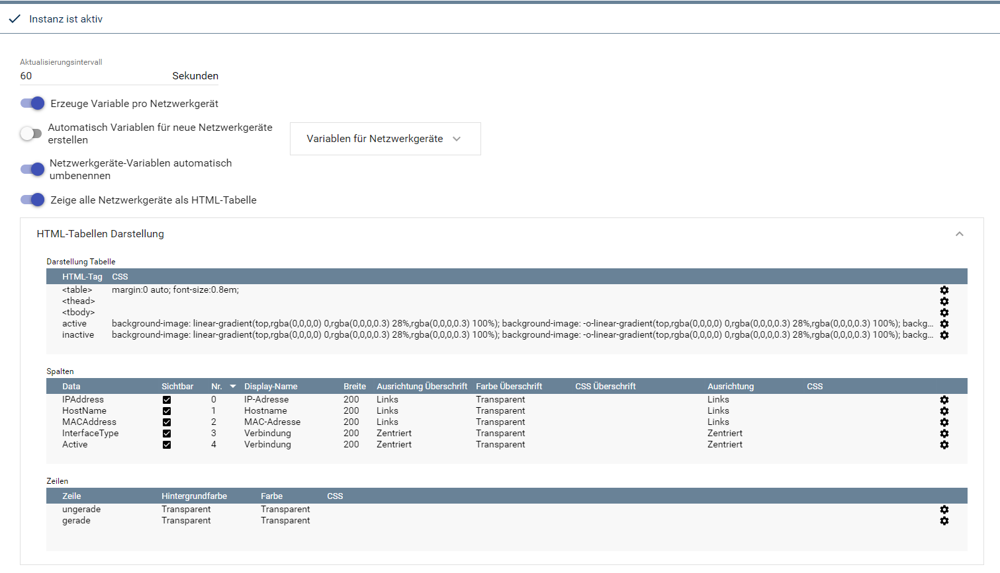
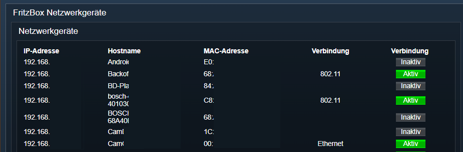
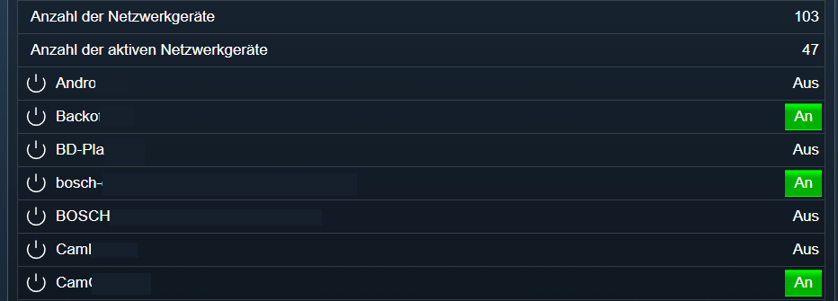

[](https://www.symcon.de/service/dokumentation/entwicklerbereich/sdk-tools/sdk-php/)
[]()
[](https://www.symcon.de/de/service/dokumentation/installation/migrationen/v60-v61-q1-2022/)  
[](https://creativecommons.org/licenses/by-nc-sa/4.0/)
[](https://github.com/Nall-chan/FritzBox/actions) [](https://github.com/Nall-chan/FritzBox/actions)  
[](#2-spenden)
[](#2-spenden)  

# FritzBox Hosts <!-- omit in toc -->
Abfragen und anzeigen von Hostnamen und Onlinestatus von Geräte im Netzwerk.  

### Inhaltsverzeichnis <!-- omit in toc -->

- [1. Funktionsumfang](#1-funktionsumfang)
- [2. Voraussetzungen](#2-voraussetzungen)
- [3. Software-Installation](#3-software-installation)
- [4. Einrichten der Instanzen in IP-Symcon](#4-einrichten-der-instanzen-in-ip-symcon)
- [5. Statusvariablen und Profile](#5-statusvariablen-und-profile)
  - [Statusvariablen](#statusvariablen)
  - [Profile](#profile)
- [6. WebFront](#6-webfront)
- [7. PHP-Funktionsreferenz](#7-php-funktionsreferenz)
- [8. Aktionen](#8-aktionen)
- [9. Anhang](#9-anhang)
  - [1. Changelog](#1-changelog)
  - [2. Spenden](#2-spenden)
- [10. Lizenz](#10-lizenz)

## 1. Funktionsumfang

* Alte Variablen vom FB-Project sind **nicht** kompatibel.
* Ermöglicht das auslesen alle der FritzBox bekannten Netzwerkgeräte.  
* Darstellung alle Hosts und des jeweiligen Onlinezustand als Symcon Variable.  
* Darstellung alle Hosts und des jeweiligen Onlinezustand als HTML Tabelle.  
* Möglichkeit WOL an Hosts zu senden.  

## 2. Voraussetzungen

- IP-Symcon ab Version 6.0

## 3. Software-Installation

* Über den Module Store das `FritzBox`-Modul installieren.

## 4. Einrichten der Instanzen in IP-Symcon

 Es wird empfohlen Instanzen über die entsprechenden [FritzBox Konfigurator](../FritzBox%20Configurator/README.md)-Instanz zu erzeugen.  
 
 Unter 'Instanz hinzufügen' ist das 'FritzBox Hosts'-Modul unter dem Hersteller 'AVM' aufgeführt.

__Konfigurationsseite__:

  

__Konfigurationsparameter__:  

| Name                 | Typ            | Beschreibung                                                         |
| -------------------- | -------------- | -------------------------------------------------------------------- |
| RefreshInterval      | integer        | Aktualisierungsintervall in Sekunden                                 |
| HostAsVariable       | boolean        | Darstellung als Symcon Variable                                      |
| AutoAddHostVariables | boolean        | Für neue Hosts automatisch eine Variable anlegen                     |
| RenameHostVariables  | boolean        | Variablen automatisch umbenennen                                     |
| HostVariables        | string / Liste | Konfiguration der Variablen per Host                                 |
| HostAsTable          | boolean        | Ausgabe der Hosts als HTML-Tabelle in einer String-Variable          |
| Table                | string / Liste | HTML/CSS Konfiguration der HTML-Tabelle                              |
| Columns              | string / Liste | HTML/CSS Konfiguration der Spalten (pro Spalte)                      |
| Rows                 | string / Liste | HTML/CSS Konfiguration der Zeilen (Überschrift, gerade und ungerade) |

## 5. Statusvariablen und Profile

Die Statusvariablen werden automatisch angelegt. Das Löschen einzelner kann zu Fehlfunktionen führen.

### Statusvariablen

| Ident              | Name           | Typ     | Beschreibung           |
| ------------------ | -------------- | ------- | ---------------------- |
| HostTable          | Netzwerkgeräte | string  | HTML Tabelle der Hosts |
| `IP` + IP Adresse  | Hostname       | boolean | Onlinezustand          |
| `MAC` + IP Adresse | Hostname       | boolean | Onlinezustand          |

### Profile

Dieses Modul erzeugt keine Variablenprofile.  

## 6. WebFront

HTML Tabelle:  
  

---  

Variablen:  
  

## 7. PHP-Funktionsreferenz

```php
boolean FB_RefreshHostList(integer $InstanceID);
false|integer FB_GetHostNumberOfEntries(integer $InstanceID);
array|false FB_GetSpecificHostEntry(integer $InstanceID, string $MACAddress);
array|false FB_GetGenericHostEntry(integer $InstanceID, integer $Index);
array|false FB_GetSpecificHostEntryByIP(integer $InstanceID, string $IPAddress);
int|false FB_GetChangeCounter(integer $InstanceID);
boolean FB_SetHostNameByMACAddress(integer $InstanceID, string $MACAddress, string $Hostname);
boolean FB_GetAutoWakeOnLANByMACAddress(integer $InstanceID, string $MACAddress);
boolean FB_SetAutoWakeOnLANByMACAddress(integer $InstanceID, string $MACAddress, boolean $Enabled);
boolean FB_WakeOnLANByMACAddress(integer $InstanceID, string $MACAddress);
array|false FB_HostsCheckUpdate(integer $InstanceID);
boolean FB_HostDoUpdate(integer $InstanceID, string $MACAddress);
string|false FB_GetHostListPath(integer $InstanceID);
string|false FB_GetMeshListPath(integer $InstanceID);
```

## 8. Aktionen

Folgende Aktion ist Verfügbar:

ActionId: `{F7C8619E-21C1-4EE1-CCA8-0AC4CB111AD8}`  
Host mit WOL aufwecken  

## 9. Anhang

### 1. Changelog

[Changelog der Library](../README.md#changelog)

### 2. Spenden

  Die Library ist für die nicht kommerzielle Nutzung kostenlos, Schenkungen als Unterstützung für den Autor werden hier akzeptiert:  

<a href="https://www.paypal.com/donate?hosted_button_id=G2SLW2MEMQZH2" target="_blank"></a>  

[](https://www.amazon.de/hz/wishlist/ls/YU4AI9AQT9F?ref_=wl_share) 

## 10. Lizenz

  IPS-Modul:  
  [CC BY-NC-SA 4.0](https://creativecommons.org/licenses/by-nc-sa/4.0/)  

