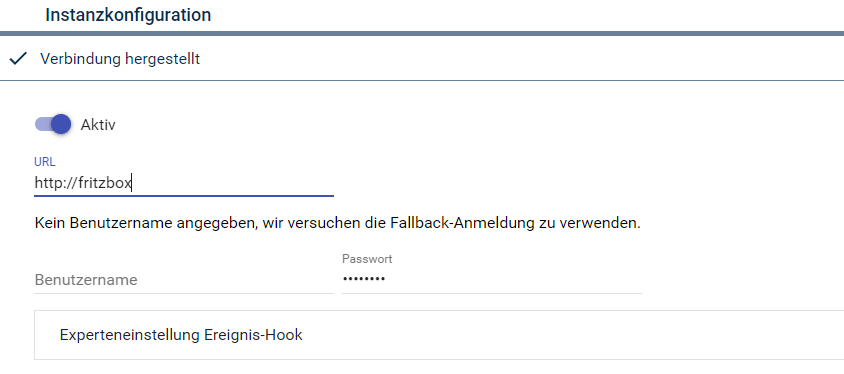

[](https://www.symcon.de/service/dokumentation/entwicklerbereich/sdk-tools/sdk-php/)
[](https://community.symcon.de/t/modul-fritzbox-ersatz-fuer-fritzbox-project/125451)
[](https://www.symcon.de/de/service/dokumentation/installation/migrationen/v70-v71-q1-2024/)  
[](https://creativecommons.org/licenses/by-nc-sa/4.0/)
[](https://github.com/Nall-chan/FritzBox/actions)
[](https://github.com/Nall-chan/FritzBox/actions)  
[](#2-spenden)
[](#2-spenden)  

# FritzBox IO <!-- omit in toc -->
Instanz zur Kommunikation mit der FritzBox.  

### Inhaltsverzeichnis <!-- omit in toc -->

- [1. Funktionsumfang](#1-funktionsumfang)
- [2. Voraussetzungen](#2-voraussetzungen)
- [3. Software-Installation](#3-software-installation)
- [4. Einrichten der Instanzen in IP-Symcon](#4-einrichten-der-instanzen-in-ip-symcon)
- [5. Statusvariablen und Profile](#5-statusvariablen-und-profile)
  - [Statusvariablen](#statusvariablen)
  - [Profile](#profile)
- [6. WebFront](#6-webfront)
- [7. PHP-Funktionsreferenz](#7-php-funktionsreferenz)
- [8. Aktionen](#8-aktionen)
- [9. Anhang](#9-anhang)
  - [1. Changelog](#1-changelog)
  - [2. Spenden](#2-spenden)
- [10. Lizenz](#10-lizenz)

## 1. Funktionsumfang

* Instanz zur Kommunikation mit der FritzBox.  

## 2. Voraussetzungen

- Symcon ab Version 7.1

## 3. Software-Installation

* Über den Module Store das `FritzBox`-Modul installieren.

## 4. Einrichten der Instanzen in IP-Symcon

 Wenn eine Instanz von dem  [FritzBox Konfigurator](../FritzBox%20Configurator/README.md) über die [FritzBox Discovery](../FritzBox%20Discovery/README.md)-Instanz erstellt wird, wo wird automatisch eine `FritzBox-IO`-Instanz erzeugt.  

 Sollte der Bedarf bestehen eine Instanz manuell zu erzeugen, so ist unter 'Instanz hinzufügen' das 'FritzBox IO'-Modul unter dem Hersteller 'AVM' aufgeführt.  

Obwohl die Instanz sich `FritzBox-IO` nennt, so wird diese im Objektbaum unter den Splitter-Instanzen aufgelistet.

__Konfigurationsseite__:

**Zur fehlerfreien Kommunikation und korrekten Konfiguration sind die [Hinweise zum Symcon-System / Host](../README.md#hinweise-zum-symcon-system--host) der Library zu beachten!**  

  

__Konfigurationsparameter__:  

| Name       | Typ     | Beschreibung                                             |
| ---------- | ------- | -------------------------------------------------------- |
| Open       | boolean | Verbindung aktiveren                                     |
| Host       | string  | URL der FritzBox                                         |
| Username   | string  | Benutzername zur Anmeldung                               |
| Password   | string  | Passwort zum Benutzernamen                               |
| ReturnIP   | string  | IP-Adresse unter welcher die FritzBox IP-Symcon erreicht |
| ReturnPort | integer | Port zur o.a. IP-Adresse                                 |

## 5. Statusvariablen und Profile

Die Statusvariablen werden automatisch angelegt. Das Löschen einzelner kann zu Fehlfunktionen führen.

### Statusvariablen

| Ident          | Name           | Typ          | Beschreibung                          |
| -------------- | -------------- | ------------ | ------------------------------------- |
| ConnectionType | Verbindungsart | string       | Genutzte WAN Verbindung des Layer 3   |
| Hosts          | Hosts          | Medienobjekt | Enthält die Host Tabelle der FritzBox |
| Phonebook_xxx  | Phonebook_xxx  | Medienobjekt | Telefonbücher der FritzBox            |

### Profile

Dieses Modul erzeugt keine Variablenprofile.  

## 6. WebFront

Dieses Modul ist nicht zur Darstellung im WebFront gedacht.

## 7. PHP-Funktionsreferenz

```php
boolean FB_Reboot(integer $InstanzID);
```

## 8. Aktionen

Keine Aktionen verfügbar.

## 9. Anhang

### 1. Changelog

[Changelog der Library](../README.md#changelog)

### 2. Spenden

  Die Library ist für die nicht kommerzielle Nutzung kostenlos, Schenkungen als Unterstützung für den Autor werden hier akzeptiert:  

[](https://paypal.me/Nall4chan)  

[](https://www.amazon.de/hz/wishlist/ls/YU4AI9AQT9F?ref_=wl_share) 

## 10. Lizenz

  IPS-Modul:  
  [CC BY-NC-SA 4.0](https://creativecommons.org/licenses/by-nc-sa/4.0/)  

