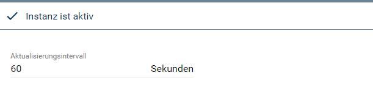
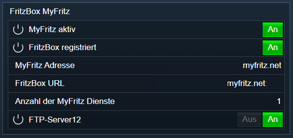

[](https://www.symcon.de/service/dokumentation/entwicklerbereich/sdk-tools/sdk-php/)
[]()
[](https://www.symcon.de/de/service/dokumentation/installation/migrationen/v60-v61-q1-2022/)  
[](https://creativecommons.org/licenses/by-nc-sa/4.0/)
[](https://github.com/Nall-chan/FritzBox/actions) [](https://github.com/Nall-chan/FritzBox/actions)  
[](#2-spenden)
[](#2-spenden)  

# FritzBox MyFritz <!-- omit in toc -->
Auslesen und darstellen der MyFritz Dienste.  

### Inhaltsverzeichnis <!-- omit in toc -->

- [1. Funktionsumfang](#1-funktionsumfang)
- [2. Voraussetzungen](#2-voraussetzungen)
- [3. Software-Installation](#3-software-installation)
- [4. Einrichten der Instanzen in IP-Symcon](#4-einrichten-der-instanzen-in-ip-symcon)
- [5. Statusvariablen und Profile](#5-statusvariablen-und-profile)
  - [Statusvariablen](#statusvariablen)
  - [Profile](#profile)
- [6. WebFront](#6-webfront)
- [7. PHP-Funktionsreferenz](#7-php-funktionsreferenz)
- [8. Aktionen](#8-aktionen)
- [9. Anhang](#9-anhang)
  - [1. Changelog](#1-changelog)
  - [2. Spenden](#2-spenden)
- [10. Lizenz](#10-lizenz)

## 1. Funktionsumfang

* Alte Variablen vom FB-Project sind **nicht** kompatibel.
* Auslesen und darstellen der MyFritz Registrierung.  
* Auslesen und darstellen der MyFritz Dienste.  
* Steuern von MyFritz Freigaben, **sofern es sich bei dem Ziel um den Symcon Host handelt.**  

## 2. Voraussetzungen

- IP-Symcon ab Version 6.0

## 3. Software-Installation

* Über den Module Store das `FritzBox`-Modul installieren.

## 4. Einrichten der Instanzen in IP-Symcon

 Es wird empfohlen Instanzen über die entsprechenden [FritzBox Konfigurator](../FritzBox%20Configurator/README.md)-Instanz zu erzeugen.  
 
 Unter 'Instanz hinzufügen' ist das 'FritzBox MyFritz'-Modul unter dem Hersteller 'AVM' aufgeführt.

__Konfigurationsseite__:

  

__Konfigurationsparameter__:  

| Name            | Typ     | Beschreibung                         |
| --------------- | ------- | ------------------------------------ |
| RefreshInterval | integer | Aktualisierungsintervall in Sekunden |


## 5. Statusvariablen und Profile

Die Statusvariablen werden automatisch angelegt. Das Löschen einzelner kann zu Fehlfunktionen führen.

### Statusvariablen

| Ident            | Name                 | Typ     |
| ---------------- | -------------------- | ------- |
| Enabled          | MyFritz aktiv        | boolean |
| DeviceRegistered | FritzBox registriert | boolean |
| DynDNSName       | MyFritz Adresse      | string  |
| DynDNSURL        | FritzBox URL         | string  |
| `Name`           | Name vom Service     | boolean |

### Profile

Dieses Modul erzeugt keine Variablenprofile.  

## 6. WebFront

  

## 7. PHP-Funktionsreferenz

```php
array|false FB_GetInfo(integer $InstanceID);
boolean FB_EnableService(integer $InstanceID, string $Ident, boolean $Value);
array FB_GetIdentsForActions(integer $InstanceID);
integer|false FB_GetNumberOfServices(integer $InstanceID);
array|false FB_GetServiceByIndex(integer $InstanceID, integer $Index);
boolean FB_DeleteServiceByIndex(integer $InstanceID, integer $Index);

boolean FB_SetServiceByIndex(integer $InstanceID,
  integer $Index,
  boolean $Enabled,
  string $Name,
  string $Scheme,
  integer $Port,
  string $URLPath,
  string $Type,
  string $IPv4Address,
  string $IPv6Address,
  string $IPv6InterfaceID,
  string $MACAddress,
  string $HostName
);
```

## 8. Aktionen

Folgende Aktion ist Verfügbar:

ActionId: `{54D0B9F7-56A0-7B32-97CC-DCF15E601F2F}`  
MyFritz Dienst steuern  
- Aktiviert oder deaktiviert einen MyFritz Dienst  


## 9. Anhang

### 1. Changelog

[Changelog der Library](../README.md#changelog)

### 2. Spenden

  Die Library ist für die nicht kommerzielle Nutzung kostenlos, Schenkungen als Unterstützung für den Autor werden hier akzeptiert:  

<a href="https://www.paypal.com/donate?hosted_button_id=G2SLW2MEMQZH2" target="_blank"></a>  

[](https://www.amazon.de/hz/wishlist/ls/YU4AI9AQT9F?ref_=wl_share) 

## 10. Lizenz

  IPS-Modul:  
  [CC BY-NC-SA 4.0](https://creativecommons.org/licenses/by-nc-sa/4.0/)  

