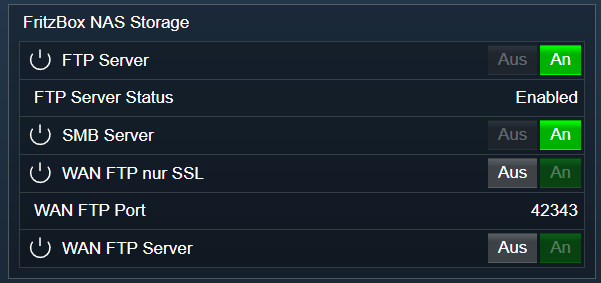

[](https://www.symcon.de/service/dokumentation/entwicklerbereich/sdk-tools/sdk-php/)
[]()
[](https://community.symcon.de/t/ip-symcon-6-0-testing/44478)  
[](https://creativecommons.org/licenses/by-nc-sa/4.0/)
[](https://github.com/Nall-chan/FritzBox/actions) [](https://github.com/Nall-chan/FritzBox/actions)  
[](#2-spenden)
[](#2-spenden)  

# FritzBox NAS Storage <!-- omit in toc -->
Status der Netzwerkfreigabe und des FTP Servers auslesen und setzen.  

### Inhaltsverzeichnis <!-- omit in toc -->

- [1. Funktionsumfang](#1-funktionsumfang)
- [2. Voraussetzungen](#2-voraussetzungen)
- [3. Software-Installation](#3-software-installation)
- [4. Einrichten der Instanzen in IP-Symcon](#4-einrichten-der-instanzen-in-ip-symcon)
- [5. Statusvariablen und Profile](#5-statusvariablen-und-profile)
  - [Statusvariablen](#statusvariablen)
  - [Profile](#profile)
- [6. WebFront](#6-webfront)
- [7. PHP-Funktionsreferenz](#7-php-funktionsreferenz)
- [8. Aktionen](#8-aktionen)
- [9. Anhang](#9-anhang)
  - [1. Changelog](#1-changelog)
  - [2. Spenden](#2-spenden)
- [10. Lizenz](#10-lizenz)

## 1. Funktionsumfang

* Alte Variablen vom FB-Project **sind** kompatibel.
* Status der Netzwerkfreigabe und des FTP Servers auslesen.  
* Aktivieren und deaktivieren der Netzwerkfreigabe und des FTP-Servers.  

## 2. Voraussetzungen

- IP-Symcon ab Version 6.0

## 3. Software-Installation

* Über den Module Store das `FritzBox`-Modul installieren.

## 4. Einrichten der Instanzen in IP-Symcon

 Es wird empfohlen Instanzen über die entsprechenden [FritzBox Konfigurator](../FritzBox%20Configurator/README.md)-Instanz zu erzeugen.  
 
 Unter 'Instanz hinzufügen' ist das 'FritzBox NAS Storage'-Modul unter dem Hersteller 'AVM' aufgeführt.

__Konfigurationsseite__:

  

__Konfigurationsparameter__:  

| Name            | Typ     | Beschreibung                         |
| --------------- | ------- | ------------------------------------ |
| RefreshInterval | integer | Aktualisierungsintervall in Sekunden |


## 5. Statusvariablen und Profile

Die Statusvariablen werden automatisch angelegt. Das Löschen einzelner kann zu Fehlfunktionen führen.

### Statusvariablen

| Ident         | Name              | Typ     |
| ------------- | ----------------- | ------- |
| SMBEnable     | SMB Server        | boolean |
| FTPEnable     | FTP Server        | boolean |
| FTPStatus     | FTP Server Status | string  |
| FTPWANEnable  | WAN FTP Server    | boolean |
| FTPWANSSLOnly | WAN FTP nur SSL   | boolean |
| FTPWANPort    | WAN FTP Port      | integer |


### Profile

Dieses Modul erzeugt keine Variablenprofile.  

## 6. WebFront

  

## 7. PHP-Funktionsreferenz

```php
array|false FB_GetInfo(integer $InstanzID);
bool FB_SetSMBServer(integer $InstanzID, boolean $Enable);
bool FB_SetFTPServer(integer $InstanzID, boolean $Enable);
bool FB_SetFTPServerWAN(integer $InstanzID, boolean $Enable, boolean $SSLOnly);
```

## 8. Aktionen

Folgende Aktion ist Verfügbar:

ActionId: `{A686F0FC-12D3-D82B-7237-04718B5CDAAF}`  
SMB Freigabe steuern  
- Aktiviert oder deaktiviert die SMB Freigabe der FritzBox 

---  

ActionId: `{FEE9B3A7-1853-6914-EE2E-4A11D79A57A8}`  
FTP-Dienst steuern  
- Aktiviert oder deaktiviert den FTP Dienst der FritzBox  

---  

ActionId: `{C0F2E8C9-7841-57B8-5D4E-ADC1A14E6F92}`  
WAN FTP-Dienst steuern  
- Aktiviert oder deaktiviert den WAN FTP Dienst der FritzBox  

## 9. Anhang

### 1. Changelog

[Changelog der Library](../README.md#changelog)

### 2. Spenden

  Die Library ist für die nicht kommerzielle Nutzung kostenlos, Schenkungen als Unterstützung für den Autor werden hier akzeptiert:  

<a href="https://www.paypal.com/donate?hosted_button_id=G2SLW2MEMQZH2" target="_blank"></a>  

[](https://www.amazon.de/hz/wishlist/ls/YU4AI9AQT9F?ref_=wl_share) 

## 10. Lizenz

  IPS-Modul:  
  [CC BY-NC-SA 4.0](https://creativecommons.org/licenses/by-nc-sa/4.0/)  

