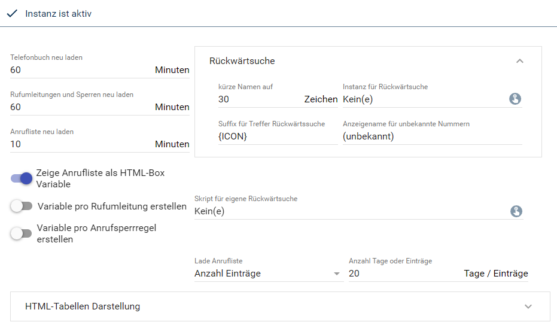
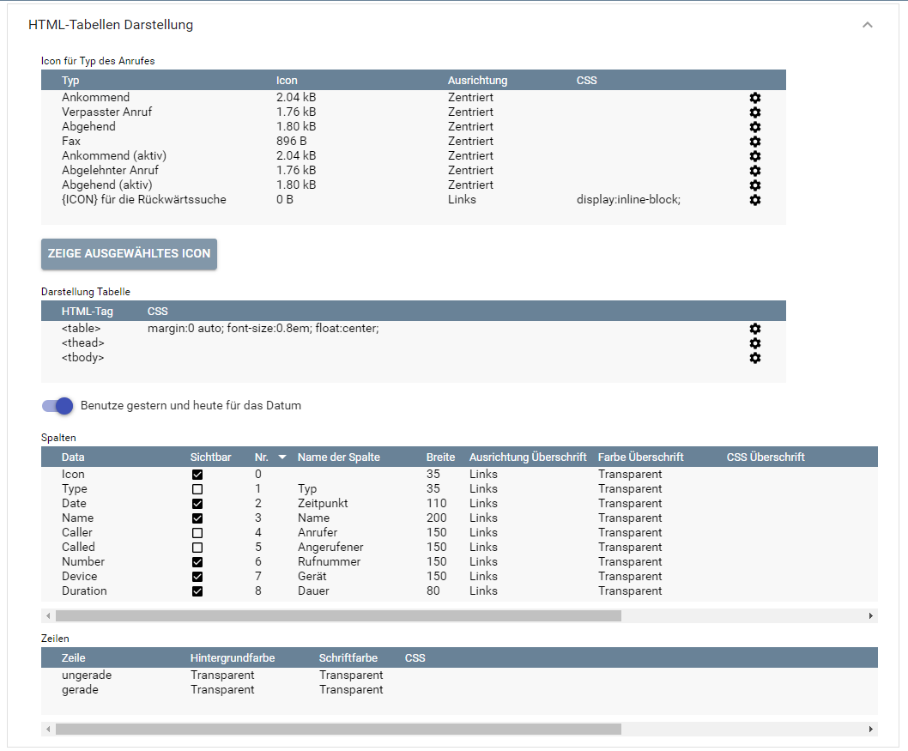
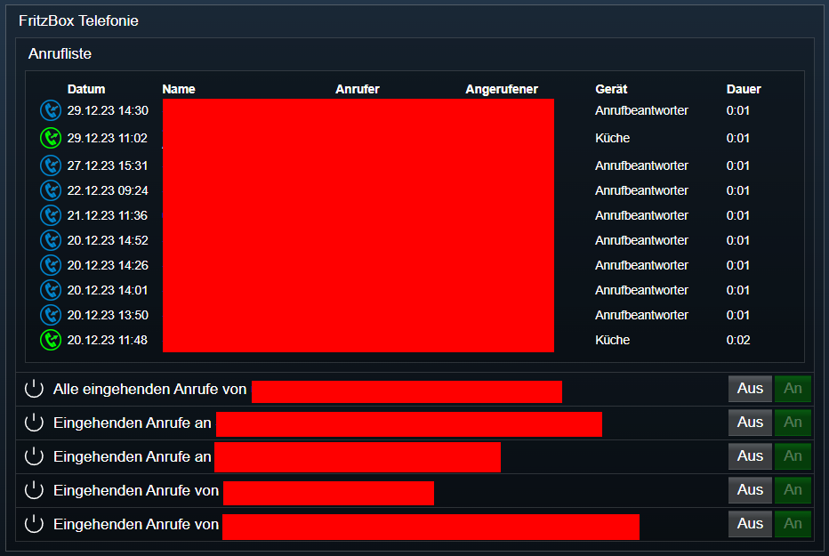

[](https://www.symcon.de/service/dokumentation/entwicklerbereich/sdk-tools/sdk-php/)
[
]()
[  
[](https://creativecommons.org/licenses/by-nc-sa/4.0/)
[](https://github.com/Nall-chan/FritzBox/actions) [](https://github.com/Nall-chan/FritzBox/actions)  
[](#2-spenden)
[](#2-spenden)  

# FritzBox Telefonie <!-- omit in toc -->
Verarbeitet alle Telefonie-Funktionen.  

### Inhaltsverzeichnis <!-- omit in toc -->

- [1. Funktionsumfang](#1-funktionsumfang)
- [2. Voraussetzungen](#2-voraussetzungen)
- [3. Software-Installation](#3-software-installation)
- [4. Einrichten der Instanzen in IP-Symcon](#4-einrichten-der-instanzen-in-ip-symcon)
- [5. Statusvariablen und Profile](#5-statusvariablen-und-profile)
  - [Statusvariablen](#statusvariablen)
  - [Profile](#profile)
- [6. WebFront](#6-webfront)
- [7. PHP-Funktionsreferenz](#7-php-funktionsreferenz)
- [8. Aktionen](#8-aktionen)
- [9. Anhang](#9-anhang)
  - [1. Changelog](#1-changelog)
  - [2. Spenden](#2-spenden)
- [10. Lizenz](#10-lizenz)

## 1. Funktionsumfang

* Auslesen der Anrufliste und darstellen als HTML-Tabelle.  
* Auslesen und zwischenspeichern der Telefonbücher.  
* Rückwärtssuche in den Telefonbüchern.  
* Anrufblockaden und Rufumleitungen auslesen, schalten und verwalten.  

## 2. Voraussetzungen

- IP-Symcon ab Version 6.0

## 3. Software-Installation

* Über den Module Store das `FritzBox`-Modul installieren.

## 4. Einrichten der Instanzen in IP-Symcon

 Es wird empfohlen Instanzen über die entsprechenden [FritzBox Konfigurator](../FritzBox%20Configurator/README.md)-Instanz zu erzeugen.  
 
 Unter 'Instanz hinzufügen' ist das 'FritzBox Telefonie'-Modul unter dem Hersteller 'AVM' aufgeführt.

**Diese Instanz unterstützt das `Rückwärtssuche`-Modul**  

__Konfigurationsseite__:  

  

  

__Konfigurationsparameter__: 
| Name                          | Typ            | Beschreibung                                                                             |
| ----------------------------- | -------------- | ---------------------------------------------------------------------------------------- |
| RefreshIntervalPhonebook      | integer        | Aktualisierungsintervall der Telefonbücher                                               |
| RefreshIntervalDeflectionList | integer        | Aktualisierungsintervall Rufumleitungen und Anrufblockaden                               |
| RefreshIntervalCallLog        | integer        | Aktualisierungsintervall der Anrufliste (*)                                              |
| CallLogAsVariable             | boolean        | Ausgabe der Gespräche als HTML-Tabelle in einer String-Variable                          |
| DeflectionAsVariable          | boolean        | Rufumleitung als Variable erstellen                                                      |
| CallBarringAsVariable         | boolean        | Anrufblockaden als Variable erstellen                                                    |
| UseRelativDate                | boolean        | Relative Datumsangabe                                                                    |
| ReverseSearchInstanceID       | integer        | InstanzID einer Rückwärtssuche-Instanz                                                   |
| CustomSearchScriptID          | integer        | ObjectID eines eigenen Skriptes für individuelle Rückwärtssuche                          |
| MaxNameSize                   | integer        | Einkürzen von Namen der Gesprächspartner auf MaxNameSize Zeichen                         |
| SearchMarker                  | string         | Marker welche dem Namen vorangestellt wird, wenn der Name aus einer Rückwärtssuche kommt |
| UnknownNumberName             | string         | Zeichenkette welche angezeigt wird, wenn kein Name bekannt ist                           |
| NotShowWarning                | boolean        | Warnmeldung abschalten, wenn das Rückwärtssuche Modul nicht installiert ist              |
| LoadListType                  | integer        | Art der maximalen Anzahl                                                                 |
| LastEntries                   | integer        | Anzahl von der Art welche geladen wird                                                   |
| Table                         | string / Liste | HTML/CSS Konfiguration der HTML-Tabelle                                                  |
| Columns                       | string / Liste | HTML/CSS Konfiguration der Spalten (pro Spalte)                                          |
| Rows                          | string / Liste | HTML/CSS Konfiguration der Zeilen (Überschrift, gerade und ungerade)                     |
| Icons                         | string / Liste | Icon für jedes Ereignis, wird in der Spalte Icon in der HTML Tabelle angezeigt           |

## 5. Statusvariablen und Profile

Die Statusvariablen werden automatisch angelegt. Das Löschen einzelner kann zu Fehlfunktionen führen.

### Statusvariablen

| Ident                                    | Name                             | Typ     | Beschreibung                |
| ---------------------------------------- | -------------------------------- | ------- | --------------------------- |
| CallLog                                  | Anrufliste                       | string  | HTML Tabelle der Anrufliste |
| D+`RuleType`+`Number`+`Mode`+`Target`    | `Beschreibung der Rufumleitung`  | boolean | Status der Rufumleitung     |
| C+`RuleType`+`Number`+`Mode`+`Phonebook` | `Beschreibung der Anrufblockade` | boolean | Status der Anrufblockade    |

### Profile

Dieses Modul erzeugt keine Variablenprofile.  

## 6. WebFront



## 7. PHP-Funktionsreferenz

```php
string|false FB_GetCallLog(integer $InstanzID);
string|false FB_GetPhonebookList(integer $InstanzID);
array| false FB_GetPhonebook(integer $InstanzID, integer $PhonebookID);
array| false FB_GetPhonebookEntry(integer $InstanzID, integer $PhonebookID, integer $PhonebookEntryID);
array| false FB_GetPhonebookEntryUID(integer $InstanzID, integer $PhonebookID, integer $PhonebookEntryUniqueID);
array|false FB_GetPhonebooks(integer $InstanzID);
array|false FB_GetPhonebookEntrysByNumber(integer $InstanzID, string $Number);
string|false FB_SearchNameByNumber(integer $InstanzID, string $Number, string $AreaCode);
string|false FB_GetDECTHandsetList(integer $InstanzID);
array|false FB_GetDECTHandsetInfo(integer $InstanzID, integer $DectID);
integer|false FB_GetNumberOfDeflections(integer $InstanzID);
string|false FB_GetDeflections(integer $InstanzID);
array|false FB_GetDeflection(integer $InstanzID, integer $DeflectionId);
boolean FB_SetDeflectionEnable(integer $InstanzID, integer $DeflectionId, boolean $Enable);
string|false FB_GetCallBarringList(integer $InstanzID);
array|false FB_GetCallBarringEntry(integer $InstanzID, integer $PhonebookEntryID);
array|false FB_GetCallBarringEntryByNum(integer $InstanzID, string $Number);
boolean FB_SetCallBarringEntry(integer $InstanzID, string $PhonebookEntryData);
boolean FB_DeleteCallBarringEntryUID(integer $InstanzID, string $PhonebookEntryData);
```

## 8. Aktionen

Keine Aktionen verfügbar.

## 9. Anhang

### 1. Changelog

[Changelog der Library](../README.md#changelog)

### 2. Spenden

  Die Library ist für die nicht kommerzielle Nutzung kostenlos, Schenkungen als Unterstützung für den Autor werden hier akzeptiert:  

[](https://paypal.me/Nall4chan)  

[](https://www.amazon.de/hz/wishlist/ls/YU4AI9AQT9F?ref_=wl_share) 

## 10. Lizenz

  IPS-Modul:  
  [CC BY-NC-SA 4.0](https://creativecommons.org/licenses/by-nc-sa/4.0/)  

