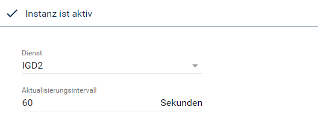
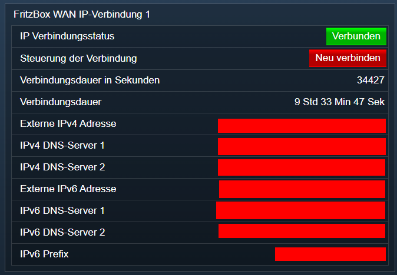

[](https://www.symcon.de/service/dokumentation/entwicklerbereich/sdk-tools/sdk-php/)
[
]()
[](https://www.symcon.de/de/service/dokumentation/installation/migrationen/v70-v71-q1-2024/)  
[](https://creativecommons.org/licenses/by-nc-sa/4.0/)
[](https://github.com/Nall-chan/FritzBox/actions) [](https://github.com/Nall-chan/FritzBox/actions)  
[](#2-spenden)
[](#2-spenden)  

# FritzBox WAN IP Connection <!-- omit in toc -->
Auslesen der WAN IP Verbindung.  

### Inhaltsverzeichnis <!-- omit in toc -->

- [1. Funktionsumfang](#1-funktionsumfang)
- [2. Voraussetzungen](#2-voraussetzungen)
- [3. Software-Installation](#3-software-installation)
- [4. Einrichten der Instanzen in IP-Symcon](#4-einrichten-der-instanzen-in-ip-symcon)
- [5. Statusvariablen und Profile](#5-statusvariablen-und-profile)
  - [Statusvariablen](#statusvariablen)
  - [Profile](#profile)
- [6. WebFront](#6-webfront)
- [7. PHP-Funktionsreferenz](#7-php-funktionsreferenz)
- [8. Aktionen](#8-aktionen)
- [9. Anhang](#9-anhang)
  - [1. Changelog](#1-changelog)
  - [2. Spenden](#2-spenden)
- [10. Lizenz](#10-lizenz)

## 1. Funktionsumfang

* Alte Variablen vom FB-Project **sind** kompatibel.  
* Auslesen der WAN IP Verbindung.  
* Verbindungsaufbau und -abbau steuern.  

## 2. Voraussetzungen

- IP-Symcon ab Version 6.0

## 3. Software-Installation

* Über den Module Store das `FritzBox`-Modul installieren.


## 4. Einrichten der Instanzen in IP-Symcon

 Es wird empfohlen Instanzen über die entsprechenden [FritzBox Konfigurator](../FritzBox%20Configurator/README.md)-Instanz zu erzeugen.  
 
 Unter 'Instanz hinzufügen' ist das 'FritzBox WAN IP-Verbindung'-Modul unter dem Hersteller 'AVM' aufgeführt.

__Konfigurationsseite__:

  

__Konfigurationsparameter__:  

| Name            | Typ     | Beschreibung                         |
| --------------- | ------- | ------------------------------------ |
| Index           | integer | Dienst (Service Index)               |
| RefreshInterval | integer | Aktualisierungsintervall in Sekunden |

## 5. Statusvariablen und Profile

Die Statusvariablen werden automatisch angelegt. Das Löschen einzelner kann zu Fehlfunktionen führen.

### Statusvariablen

| Ident               | Name                         | Typ     |
| ------------------- | ---------------------------- | ------- |
| ConnectionAction    | Steuerung der Verbindung     | integer |
| ConnectionStatus    | IP Verbindungsstatus         | boolean |
| UptimeRAW           | Verbindungsdauer in Sekunden | integer |
| Uptime              | Verbindungsdauer             | string  |
| ExternalIPAddress   | Externe IPv4 Adresse         | string  |
| IPv4DNSServer1      | IPv4 DNS-Server 1            | string  |
| IPv4DNSServer2      | IPv4 DNS-Server 2            | string  |
| ExternalIPv6Address | Externe IPv6 Adresse         | string  |
| IPv6Prefix          | IPv6 Prefix                  | string  |
| IPv6DNSServer1      | IPv6 DNS-Server 1            | string  |
| IPv6DNSServer2      | IPv6 DNS-Server 2            | string  |

### Profile

| Name                | Typ     |
| ------------------- | ------- |
| FB.Connect          | integer |
| FB.ConnectionStatus | boolean |

## 6. WebFront

  

## 7. PHP-Funktionsreferenz

```php
array|false FB_GetConnectionTypeInfo(integer $InstanzID);
boolean FB_ForceTermination(integer $InstanzID);
boolean FB_RequestTermination(integer $InstanzID);
boolean FB_RequestConnection(integer $InstanzID);
array|false FB_GetStatusInfo(integer $InstanzID);
string|false FB_GetExternalIPAddress(integer $InstanzID);
array|false FB_GetDNSServer(integer $InstanzID);
array|false FB_GetExternalIPv6Address(integer $InstanzID);
array|false FB_GetIPv6DNSServer(integer $InstanzID);
array|false FB_GetIPv6Prefix(integer $InstanzID);
array|false FB_GetNATRSIPStatus(integer $InstanzID);
integer|false FB_GetWarnDisconnectDelay(integer $InstanzID);
boolean FB_SetWarnDisconnectDelay(integer $DelayTime);
integer|false FB_GetIdleDisconnectTime(integer $InstanzID);
boolean FB_SetIdleDisconnectTime(integer $Timeout);
integer|false FB_GetAutoDisconnectTime(integer $InstanzID);
boolean FB_SetAutoDisconnectTime(integer $InstanzID, integer $AutoDisconnectTime);
```

## 8. Aktionen

Folgende Aktionen sind Verfügbar:

ActionId: `{B971BAC4-DB28-4C60-39E6-BFCA1B94991C}`  
Verbindung anfordern  
- Startet einen Verbindungsaufbau der FritzBox zum Internet  

---  
 
ActionId: `{87E9978A-0B44-B1E8-5C89-87EC3AD51AA3}`  
Trenne Verbindung  
- Trennt die Verbindung der FritzBox zum Internet  

## 9. Anhang

### 1. Changelog

[Changelog der Library](../README.md#changelog)

### 2. Spenden

  Die Library ist für die nicht kommerzielle Nutzung kostenlos, Schenkungen als Unterstützung für den Autor werden hier akzeptiert:  

[](https://paypal.me/Nall4chan)  

[](https://www.amazon.de/hz/wishlist/ls/YU4AI9AQT9F?ref_=wl_share) 

## 10. Lizenz

  IPS-Modul:  
  [CC BY-NC-SA 4.0](https://creativecommons.org/licenses/by-nc-sa/4.0/)  

