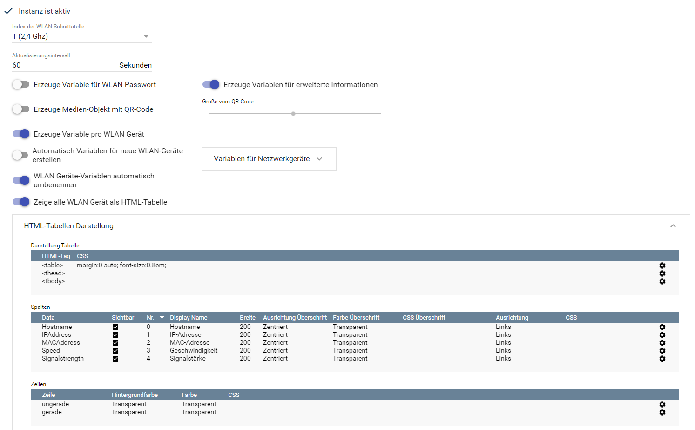
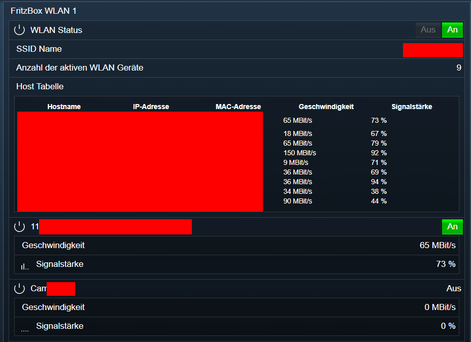

[](https://www.symcon.de/service/dokumentation/entwicklerbereich/sdk-tools/sdk-php/)
[]()
[](https://www.symcon.de/de/service/dokumentation/installation/migrationen/v60-v61-q1-2022/)  
[](https://creativecommons.org/licenses/by-nc-sa/4.0/)
[](https://github.com/Nall-chan/FritzBox/actions) [](https://github.com/Nall-chan/FritzBox/actions)  
[](#2-spenden)
[](#2-spenden)  

# FritzBox WLAN <!-- omit in toc -->
Auslesen und steuern der WLAN Funktionen.  

### Inhaltsverzeichnis <!-- omit in toc -->

- [1. Funktionsumfang](#1-funktionsumfang)
- [2. Voraussetzungen](#2-voraussetzungen)
- [3. Software-Installation](#3-software-installation)
- [4. Einrichten der Instanzen in IP-Symcon](#4-einrichten-der-instanzen-in-ip-symcon)
- [5. Statusvariablen und Profile](#5-statusvariablen-und-profile)
  - [Statusvariablen](#statusvariablen)
  - [Profile](#profile)
- [6. WebFront](#6-webfront)
- [7. PHP-Funktionsreferenz](#7-php-funktionsreferenz)
- [8. Aktionen](#8-aktionen)
- [9. Anhang](#9-anhang)
  - [1. Changelog](#1-changelog)
  - [2. Spenden](#2-spenden)
- [10. Lizenz](#10-lizenz)

## 1. Funktionsumfang

* Alte Variablen vom FB-Project sind **nicht** kompatibel.  
* Auslesen und steuern der WLAN Funktionen.  
* Darstellung der verbundenen Geräte als HTML Tabelle.  
* Verbunden Zustand von Geräten als Symcon Variable darstellen.  
* QR-Code und WebFront Popup für einfache Anmeldung im WLAN.  

## 2. Voraussetzungen

- IP-Symcon ab Version 6.0

## 3. Software-Installation

* Über den Module Store das `FritzBox`-Modul installieren.

## 4. Einrichten der Instanzen in IP-Symcon

 Es wird empfohlen Instanzen über die entsprechenden [FritzBox Konfigurator](../FritzBox%20Configurator/README.md)-Instanz zu erzeugen.  
 
 Unter 'Instanz hinzufügen' ist das 'FritzBox WLAN'-Modul unter dem Hersteller 'AVM' aufgeführt.

__Konfigurationsseite__:  

  

__Konfigurationsparameter__: 
| Name                  | Typ            | Beschreibung                                                         |
| --------------------- | -------------- | -------------------------------------------------------------------- |
| Index                 | integer        | Index der WLAN-Schnittstelle                                         |
| HostAsVariable        | boolean        | Erzeuge Variable pro WLAN Gerät                                      |
| HostVariables         | string / Liste | Liste der Variablen für Netzwerkgeräte                               |
| InfoVariables         | boolean        | Erzeuge Variablen für erweiterte Informationen                       |
| AutoAddHostVariables  | boolean        | Automatisch Variablen für neue WLAN-Geräte erstellen                 |
| RenameHostVariables   | boolean        | WLAN Geräte-Variablen automatisch umbenennen                         |
| ShowWLanKeyAsVariable | boolean        | Erzeuge Variable für WLAN Passwort                                   |
| ShowWLanKeyAsQRCode   | boolean        | Erzeuge Medien-Objekt mit QR-Code                                    |
| QRCodeSize            | integer        | Größe vom QR-Code                                                    |
| RefreshInterval       | integer        | Aktualisierungsintervall                                             |
| HostAsTable           | boolean        | Zeige alle WLAN Gerät als HTML-Tabelle                               |
| Table                 | string / Liste | HTML/CSS Konfiguration der HTML-Tabelle                              |
| Columns               | string / Liste | HTML/CSS Konfiguration der Spalten (pro Spalte)                      |
| Rows                  | string / Liste | HTML/CSS Konfiguration der Zeilen (Überschrift, gerade und ungerade) |


## 5. Statusvariablen und Profile

Die Statusvariablen werden automatisch angelegt. Das Löschen einzelner kann zu Fehlfunktionen führen.

### Statusvariablen

| Ident               | Name                              | Typ           | Beschreibung                  |
| ------------------- | --------------------------------- | ------------- | ----------------------------- |
| X_AVM_DE_APEnabled  | WLAN Status                       | boolean       | WLAN aktiv                    |
| SSID                | SSID Name                         | string        | Name des WLAN                 |
| KeyPassphrase       | Passwort                          | string        | Passwort des WLAN             |
| TimeoutActive       | Automatisch deaktivieren          | boolean       | nur Gäste-WLAN                |
| TimeRemainRaw       | Restlaufzeit in Minuten           | integer       | nur Gäste-WLAN                |
| TimeRemain          | Restlaufzeit                      | string        | nur Gäste-WLAN                |
| OffTime             | Geplante Abschaltung              | integer       | nur Gäste-WLAN                |
| ForcedOff           | Keine Abschaltung wenn Gast aktiv | boolean       | nur Gäste-WLAN                |
| HostNumberOfEntries | Anzahl der aktiven WLAN Geräte    | integer       | Anzahl der verbundenen Geräte |
| QRCodeIMG           | QR-Code                           | Medien-Objekt | PNG Bild mit WLAN QR-Code     |
| HostTable           | Host Tabelle                      | string        | HTML Tabelle der Hosts        |
| `MAC`               | Names des Hosts                   | boolean       | Host verbunden                |


### Profile

| Name     | Typ     |
| -------- | ------- |
| FB.MBits | integer |

## 6. WebFront



## 7. PHP-Funktionsreferenz

```php
FB_RefreshHostList(integer $InstanzID);
FB_GetWLANDeviceListPath(integer $InstanzID);
FB_GetHTMLQRCode(integer $InstanzID);
FB_GetInfo(integer $InstanzID);
FB_SetEnable(integer $InstanzID, boolean $Enable)
FB_SetWLANConfig(
        integer $InstanzID, 
        string $MaxBitRate,
        integer $Channel,
        string $SSID,
        string $BeaconType,
        boolean $MACAddressControlEnabled,
        string $BasicEncryptionModes,
        string $BasicAuthenticationMode
    )
FB_SetKeyPassphrase(
        integer $InstanzID, 
        string $KeyPassphrase
    )
FB_GetKeyPassphrase(integer $InstanzID);
FB_SetBasBeaconSecurityProperties(
        integer $InstanzID, 
        string $BasicEncryptionModes,
        string $BasicAuthenticationMode
    )
FB_GetBasBeaconSecurityProperties(integer $InstanzID);
FB_GetStatistics(integer $InstanzID);
FB_GetPacketStatistics(integer $InstanzID);
FB_GetBSSID(integer $InstanzID);
FB_GetSSID(integer $InstanzID);
FB_SetSSID(integer $InstanzID, string $SSID)
FB_GetBeaconType(integer $InstanzID);
FB_SetBeaconType(integer $InstanzID, string $BeaconType)
FB_GetChannelInfo(integer $InstanzID);
FB_SetChannel(integer $InstanzID, integer $Channel)
FB_GetBeaconAdvertisement(integer $InstanzID);
FB_SetBeaconAdvertisement(integer $InstanzID, boolean $BeaconAdvertisementEnabled)
FB_GetTotalAssociations(integer $InstanzID);
FB_GetGenericAssociatedDeviceInfo(integer $InstanzID, integer $Index)
FB_GetSpecificAssociatedDeviceInfo(integer $InstanzID, string $Mac)
FB_GetSpecificAssociatedDeviceInfoByIp(integer $InstanzID, string $Ip)
FB_GetNightControl(integer $InstanzID);
FB_GetWLANHybridMode(integer $InstanzID);
FB_SetWLANHybridMode(
        integer $InstanzID, 
        boolean $Enable,
        string $BeaconType,
        string $KeyPassphrase,
        string $SSID,
        string $BSSID,
        string $TrafficMode,
        boolean $ManualSpeed,
        integer $MaxSpeedDS,
        integer $MaxSpeedUS
    )
FB_GetWLANExtInfo(integer $InstanzID);
```

## 8. Aktionen

Folgende Aktionen ist für die Instanz `WebFront Visualisierung` verfügbar:

ActionId: `{32EFCA9C-19ED-0F6D-8728-C5EE4A9B574B}`  
Zeige WebFront Pop-Up mit WLAN Zugangsdaten  
- **Vorsicht: Auf allen Geräten welche dieses WebFront anzeigen erscheint das Pop-Up.** 
  
## 9. Anhang

### 1. Changelog

[Changelog der Library](../README.md#changelog)

### 2. Spenden

  Die Library ist für die nicht kommerzielle Nutzung kostenlos, Schenkungen als Unterstützung für den Autor werden hier akzeptiert:  

<a href="https://www.paypal.com/donate?hosted_button_id=G2SLW2MEMQZH2" target="_blank"></a>  

[](https://www.amazon.de/hz/wishlist/ls/YU4AI9AQT9F?ref_=wl_share) 

## 10. Lizenz

  IPS-Modul:  
  [CC BY-NC-SA 4.0](https://creativecommons.org/licenses/by-nc-sa/4.0/)  

