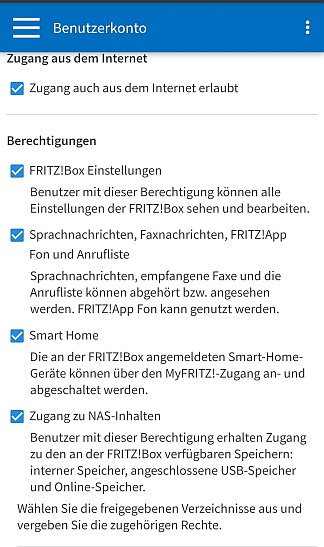
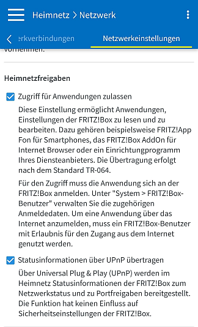

  

   

  

# FritzBox <!-- omit in toc -->

## Inhaltsverzeichnis <!-- omit in toc -->

- [Vorbemerkungen zur Library](#vorbemerkungen-zur-library)
- [Vorbemerkungen zur Integration von Geräten](#vorbemerkungen-zur-integration-von-geräten)
- [Hinweise zum Symcon-System / Host](#hinweise-zum-symcon-system--host)
- [Folgende Module beinhaltet das FritzBox Repository](#folgende-module-beinhaltet-das-fritzbox-repository)
- [Changelog](#changelog)
- [Spenden](#spenden)
- [Lizenz](#lizenz)

----------

## Vorbemerkungen zur Library

**Falls das alte FritzBox-Project noch installiert ist:**

- Deaktiviert die ScriptTimer oder setzt deren Intervall hoch. Die FritzBox reagieren empfindlich auf zu viele Anfragen.
- Schließt den Client-Socket vom Anrufmonitor in Symcon.

**Weitere Hinweise**
1. Für die Rückwärtssuche nach Rufnummern wird das Modul hier benötigt, oder ein eigenes Script
https://community.symcon.de/t/modul-rueckwaertssuche-von-rufnummern-ueber-das-internet/125450
1. Das Modul enthält fast alle Funktionen des alten FritzBox-Project, teilweise aber mit anderen Leistungsmerkmalen.
1. Die vorhandenen IPS-Variablen können teilweise von versierten Anwendern übernommen werden, eine Anleitung bzw. Beschreibung zum vorgehen folgt.
 1. Auch wenn AVM angefangen hat die SmartHome-Geräte über diese Schnittstelle bereitzustellen, so ist der Funktionsumfang noch sehr gering. Für das **AHA-HTTP-Interface** bitte das Modul von tommi benutzen, funktionsumfang kenne ich aber nicht → [neue PHP-Module als Ersatz meiner Delphi-Module](https://community.symcon.de/t/neue-php-module-als-ersatz-meiner-delphi-module/40770)
1. Zugriff auf eine FritzBox über das Internet ist **nicht** möglich!
Siehe auch CallStranger Sicherheitslücke.
Zitat AVM: 
`...ist nicht betroffen, da UPnP dort nicht aus dem Internet erreicht oder genutzt werden kann.`

----------

## Vorbemerkungen zur Integration von Geräten  

Es werden Instanzen zum auffinden (Discovery) und einrichten (Konfigurator) von Geräten in Symcon bereitgestellt.  
Diese Instanzen werden nur korrekt funktionieren, wenn die betreffenden Geräte entsprechend Konfiguriert wurden.  

Es wird dringend empfohlen vor der Integration in IPS folgende Parameter in der FritzBox zu konfigurieren / zu prüfen:

- Zugangsdaten einen Benutzers  
- Berechtigung der Zugangsdaten  
- Anrufmonitor, sofern gewünscht, per Telefon aktivieren. (`#96*5* wählen`)  

**Vorbereitungen in der FritzBox:**

Es wird dringend empfohlen einen eigenen Benutzer mit Passwort in der FritzBox anzulegen und mit folgenden Berechtigungen zu versehen (Anmeldung aus Internet sollte aus sein [siehe Hinweis 5])  

Unter Heimnetz / Netzwerk / Netzwerkeinstellungen / weitere Einstellungen bitte folgende Einstellungen setzen (Neustart der Box nicht vergessen):  

----------

## Hinweise zum Symcon-System / Host  

Um Ereignisse von der FritzBox in Symcon zu verarbeiten wird ein Webhook pro [IO-Modul](FritzBox%20IO/README.md) erzeugt.  
Hier wird beim anlegen der Instanz automatisch nur der interne WebServer von Symcon auf Port 3777 eingetragen.
Die IP-Adresse auf welchem Symcon die Daten empfängt wird automatisch ermittelt.

Bei System mit aktiven NAT-Support funktioniert die automatische Erkennung der eigenen IP-Adresse nicht. __Hier wird automatisch die NATPublicIP aus den [Symcon-Spezialschaltern](https://www.symcon.de/service/dokumentation/entwicklerbereich/spezialschalter/) benutzt.__  
**Auch bei Systemen mit aktiven NAT-Support wird extern automatisch nur der Port 3777 beim anlegen von IO-Instanzen unterstützt.**  
  
Sollte es nötig sein, so können bei Bedarf die eigene IP und der Port, sowie die Verwendung von https,  in den IO-Instanzen unter `Experteneinstellungen` geändert und fixiert werden.

Damit Geräte über das [Discovery-Modul](FritzBox%20Discovery/README.md) gefunden werden können, müssen in gerouteten Netzen und bei NAT Systemen Multicast-Pakete korrekt weitergeleitet werden.  
**Discovery funktioniert nicht in einem Docker Container welcher per NAT angebunden ist. Diese Konstellation wird aufgrund der fehlenden Multicast Fähigkeiten von Docker nicht unterstützt. In diesem Fall muss der [Konfigurator](FritzBox%20Configurator/README.md) manuell angelegt und der [IO](FritzBox%20IO/README.md) konfiguriert werden.**  
Für das Discovery werden Pakete über die Multicast-Adresse `239.255.255.250` auf Port `1900` gesendet und UDP Pakete auf Port `1901` empfangen.  

----------

## Folgende Module beinhaltet das FritzBox Repository  

- __FritzBox Discovery__ ([Dokumentation](FritzBox%20Discovery/))  
	Auffinden von FritzBox Geräten im Netzwerk.  

- __FritzBox Konfigurator__ ([Dokumentation](FritzBox%20Configurator/))  
	Konfigurator zum Anlegen von weiteren Instanzen.  

- __FritzBox IO__ ([Dokumentation](FritzBox%20IO/))  
	Instanz zur Kommunikation mit der FritzBox.  

- __FritzBox Anruf-Monitor__ ([Dokumentation](FritzBox%20Callmonitor/))  
	Anrufmonitor welcher ankommenden und abgehenden Anrufen erkennt.  

- __FritzBox DVBC__ ([Dokumentation](FritzBox%20DVBC/))  
	DVB-C Receivers der FritzBox auslesen und steuern.  

- __FritzBox DynDNS__ ([Dokumentation](FritzBox%20DDNS/))  
	Auslesen und steuern des Fernzugriff und der DynDNS Funktionen.  

- __FritzBox Geräte Informationen__ ([Dokumentation](FritzBox%20Device%20Info/))  
	Allgemeine Geräte Informationen abrufen.  

- __FritzBox DHCP Server__ ([Dokumentation](FritzBox%20DHCP%20Server/))  
	Internen DHCP-Server der FritzBox verwalten.  

- __FritzBox Dateifreigabe__ ([Dokumentation](FritzBox%20File%20Share/))  
	Dateifreigaben der FritzBox verwalten und darstellen.  

- __FritzBox Firmware Informationen__ ([Dokumentation](FritzBox%20Firmware%20Info/))  
	Auslesen von Informationen zur Firmware der FritzBox.  

- __FritzBox Host Filter__ ([Dokumentation](FritzBox%20Host%20Filter/))  
	Abfragen und Steuern des Zugangs von Clients zum Internet.  

- __FritzBox Hosts__ ([Dokumentation](FritzBox%20Hosts/))  
	Abfragen und anzeigen von Hostnamen und Onlinestatus von Geräte im Netzwerk.  

- __FritzBox MyFritz__ ([Dokumentation](FritzBox%20MyFritz/))  
	Auslesen und darstellen der MyFritz Dienste.  

- __FritzBox NAS Storage__ ([Dokumentation](FritzBox%20NAS%20Storage/))  
	Status der Netzwerkfreigabe und des FTP Servers auslesen und setzen.  

- __FritzBox Powerline__ ([Dokumentation](FritzBox%20Powerline/))  
	Auslesen der Zustände von Powerline Geräten.  

- __FritzBox SmartHome__ ([Dokumentation](FritzBox%20Homeautomation/))  
	TR64 Geräte Instanz für SmartHome Geräte der FRitzBox.  

- __FritzBox SmartHome Konfigurator__ ([Dokumentation](FritzBox%20Homeautomation%20Configurator/))  
	Konfigurator zum Anlegen von SmartHome Instanzen.  

- __FritzBox Telefonie__ ([Dokumentation](FritzBox%20Telephony/))  
	Verarbeitet alle Telefonie-Funktionen.  

- __FritzBox NTP-Server & Systemzeit__ ([Dokumentation](FritzBox%20Time/))  
	Auslesen und Steuern des NTP Dienst.  

- __FritzBox UPnP MediaServer__ ([Dokumentation](FritzBox%20UPnP%20MediaServer/))  
	Auslesen und steuern der UPnP/DLA Funktionen.  

- __FritzBox allgemeine WAN-Schnittstelle__ ([Dokumentation](FritzBox%20WAN%20Common%20Interface/))  
	Auslesen der aktuell genutzten WAN Verbindung.  

- __FritzBox DSL-Verbindung__ ([Dokumentation](FritzBox%20WAN%20DSL%20Link/))  
	Status der DSL Verbindung.  

- __FritzBox WAN physikalische WAN-Schnittstelle__ ([Dokumentation](FritzBox%20WAN%20Physical%20Interface/))  
	Status des WAN Zugang in Symcon darstellen.  

- __FritzBox WAN IP-Verbindung__ ([Dokumentation](FritzBox%20WAN%20IP%20Connection/))  
	Auslesen der WAN IP Verbindung.  

- __FritzBox WAN Port-Weiterleitung__ ([Dokumentation](FritzBox%20WAN%20PortMapping/))  
	Auslesen und darstellen der Portweiterleitungen.  

- __FritzBox Online-Speicher__ ([Dokumentation](FritzBox%20WebDav%20Storage/))  
	Auslesen und steuern des Online-Speichers.  

- __FritzBox WLAN__ ([Dokumentation](FritzBox%20WLAN/))  
	Auslesen und steuern der WLAN Funktionen.  

----------

## Changelog

Version 0.82:
- Besseres verhalten bei Neustart und Verbindungsabbrüche.  
- WLAN Setzen des Netzwerkschlüssel war nicht möglich.  
  
Version 0.81:
- Konfiguratoren erwarten jetzt einen eigenen FritzBox-IO und hängen sich nicht mehr an bestehende.  
- Konfiguratoren filtern andere Konfiguratoren welche am selben IO hängen.  
- Das erstellen von der Telefonie Instanz konnte fehlschlagen, wenn die FritzBox keine URL einer Anruferliste liefert.  
- Der für den Anrufmonitor notwendige ClientSocket wurde unter bestimmten Umständen mit falschen/ungültigen Daten aus dem FritzBox-IO gefüttert.  

Version 0.80:  
- Fehlerhafte Übersetzungen bei DVB-C, DynDNS behoben.  
- Diverse fehlende Übersetzungen ergänzt.
- Dynamisches Konfigurationsformular im Anrufmonitor war nicht komplett.  
- Dokumentation erstellt.  

Version 0.79:  
- WAN DSL-Verbindung funktionierte in 0.78 nicht mehr, Änderungen aktuell zurückgenommen.  
- SOAP Fehler mit PHP 8.2 (Symcon 7.0) behoben.  
- Dynamisches Konfigurationsformular im Anrufmonitor ergänzt.  
- Discovery-Instanz unterscheidet nicht mehr bei Groß/Kleinschreibung von Hostnamen.  
- Umbenennen von Host-Variablen in einer WLAN-Instanz konnte zu Fehlern führen.  

Version 0.78:  
- <s>Instanz WAN DSL-Verbindung liefert weitere Werte  (z.B. die CRCErrors).</s>  
- Instanz Port-Weiterleitung hat die eigene PublicIP bei NAT nicht berücksichtigt.  
- Instanz Port-Weiterleitung hat Netzwerke mit 2 Ziffern im ersten Octet (z.B. 10.x.y.z) nicht unterstützt.  
- UpnP Unsubscribe ergänzt für das korrekte Abmelden von Events an der FritzBox. (Sollte den HTTP 412 Precondition Failed Fehler beheben.)  
- Fehlte ein Eintrag in der Host-Tabelle der FritzBox **und** war das automatische umbenennen von Host-Variablen in einer WLAN-Instanz aktiv, so wurde der Name der Variable gelöscht werden und wurde als unnamed Object angezeigt.  
- Discovery-Instanz funktioniert unter Linux-OS wieder. 

Version 0.77:  
- Vorhandene WAN DSL-Verbindung Instanz wurde im Konfigurator nicht korrekt erkannt.  
- Offene Konfigurationsformulare konnten beim Modul-Update Fehlermeldungen werfen und wurden geschlossen.  
- WLAN-Instanz für das Gäste-WLAN hat immer die gleichen Geräte wie WLAN 1 angezeigt.  
  
Version 0.76:  

- Anrufmonitor hat Vorwahlen und Leerzeichen in Rufnummern nicht berücksichtigt.  
- Verfügbarkeit des Anrufmonitor der FritzBox wird vom Konfigurator immer neu überprüft.  
- LinkStatus Variablen werden als String Variablen angelegt.  
- Debug Meldungen von Ereignissen aus dem LogFile entfernt.  
- Discovery-Instanz sucht auf allen Netzwerkschnittstellen und allen IP-Adressen nach Geräten und präferiert in IPv4 Adressen der FritzBox(en).  

Version 0.75:  

 - Powerline-Instanz unterstützt automatisches umbenennen der Gerätevariablen.  
 - IPv6 unterstützung hinzugefügt (Betrifft sowohl Discovery-Instanz, als auch den FritzBox IO).  
 - Discovery-Instanz nutzt die UUID der Geräte um nach der Suche alle IPv4 und IPv6 Adressen korrekt den Geräten zuordnen zu können.
 - Discovery-Instanz präferiert Hostnamen vor IP-Adressen.  
 - Firmware Information Instanz, welche auch das wechseln des Updatekanal und schalten des AutoUpdate zulässt.  
 - 'Homeautomation Configurator' / 'SmartHome Konfigurator' wird unter 'Konfiguratoren' angelegt.  
 - Host-Instanz lässt das abwählen von Statusvariablen (von Netzwerkgeräten) zu.  
 - WLAN-Instanz lässt das abwählen von Statusvariablen (von Netzwerkgeräten) zu.  
 - Host-Filter Instanz lässt das abwählen von Statusvariablen (von Netzwerkgeräten) zu.   
 - Host-Filter Instanz stellt schaltbare Statusvariablen bereit, um Netzwerkgeräten den Internetzugang zu sperren.  
 - Sollen Variablen von WLAN-Instanzen automatisch umbenannt werden, so erfolgt dies jetzt auch wenn die Geräte offline sind.  
 - 5GhZ WLAN wird wieder korrekt in der Konfiguration erkannt.  
 - Viele Konfigurationsformulare überarbeitet.  
 - DVB-C Instanz war defekt.  
 - Sendersuchlauf für DVB-C kann gestartet/gestoppt werden.  
 - DVB-C kann de/-aktiviert werden. Achtung, Fritzbox startet neu!  
 - Rufumleitungen der Telefonie-Instanz waren teilweise defekt.  
 - Benennung der Rufumleitungen und Anrufsperren der Telefonie-Instanz verbessert.  
 - Anrufsperren können nicht mehr geschaltet werden.  

Version 0.74:  

 - Fehlermeldungen wenn die Host-Tabelle deaktiviert wurde.  
 - Neues Modul 'Homeautomation Configurator' / 'SmartHome Konfigurator'.  
 - 'Homeautomation' / 'SmartHome' Modul legt Variablen an.  
 - Durch Änderungen des HTTP-Header ab einer nicht genauer bekannten Fritz!OS Version traten 'Subscribe' Fehlermeldungen auf. Der Fehler ist behoben.  

Version 0.73:  

- Neues Modul 'Powerline' um den Zustand der Powerline Geräte darzustellen.  
- Neues Modul 'DVBC' um den Zustand des DBV-S Empfängers darzustellen und zu steuern.  
- Neues Modul 'Homeautomation' / 'SmartHome'
- Links zur Doku waren defekt.  
- Bestimmte Rufumleitungen konnten zu Fehlern führen.  
- Namen und Übersetzungen der Variablen der Rufumleitungen erweitert.  
- Bessere Fehlerbehandlung beim Auswerten der Antwort vom Event-Subscribe.  
- Fehlermeldung beim Zugriff auf die Telefonbücher und Host-Datei, wenn Symcon startet.  

Version 0.72:  

- Fehlermeldung beim Zugriff auf die Telefonbücher.  
  
Version 0.71:  

- Buffer für Anrufmonitor konnte korrupt sein, was zu Fehlermeldungen führte.  
- Timer für Anrufliste wurde falsch berechnet.  

Version 0.70:  

- Parameter für Aktionen des Anrufmonitor unterstützen Platzhalter wie bei der WebFront-Benachrichtigung z.B. {NAME}  
- Anrufliste als HTML-Box kann in der Telefonie-Instanz deaktiviert werden.  
- Abrufintervall der Anrufliste wird auf Mitternacht gesetzt, wenn der Anrufmonitor aktiv ist.  
- Entsprechender Hinweis in der Konfiguration der Telefonie-Instanz wenn Intervall der Anrufliste nicht benötigt wird.
- Namen der Telefonbücher konnten zu einem Fehler und vermehrten anlegen der Medien-Objekte führen.  
- Anrufliste unterstützt auch jetzt die Relative Datumsangabe mit gestern und heute.  

Version 0.69:  

- Verlagerung der XML Dateien in der TMP Verzeichnis rückgängig gemacht.  
- Telefonbücher und Daten der Hosts werden unterhalb des IO in einem Media-Object, mit aktivem Cache gespeichert.  
- Dadurch reduzierte Schreibzyklen auf das Speichermedium.  
- IO prüft ob Telefonie-Funktionen vorhanden sind.
- Konfigurator zeigt Telefonie-Instanzen nur bei Vorhandensein von Telefonie an.
- IO prüft ob der Port für den Anrufmonitor auf der FritzBox freigeschaltet wurde.  
- Konfigurator bringt eine Meldung wenn der Anrufmonitor auf der FritzBox nicht freigeschaltet wurde.  
- Telefonie-Instanzen laden Telefonbücher, Rufumleitungen und Anrufsperren beim übernehmen der Änderungen und somit auch beim anlegen/neustart.  
- IO ermittelt die Vorwahl (OKZ, LKZ inklusive Prefix).  
- Anrufliste-Instanz übernimmt Vorwahl vom IO.
- Anrufliste-Instanz meldet wenn die Vorwahl nicht erkannt wurde und fordert zum manuellen konfigurieren auf.  
- WLAN und Host-Filter Instanzen geben einen Link zum Konfigurator aus, wenn die Host-Instanz fehlt.  

Version 0.68:  

- Ist der NATSupport von Symcon aktiviert, aber keine PublicIP konfiguriert, so wird im FritzBox-IO eine Meldung ausgegeben.  
- NATSupport und FritzBox in anderen Subnetzen werden unterstützt (außer Discovery-Instanz!).  
- Fehlende Übersetzungen im Konfigurator ergänzt
- Neue Instanz-Funktion für die Suche nach Kontakten in den Telefonbüchern (FB_GetPhonebookEntrysByNumber(12345 /* FritzBox Telefonie */, string $Number))  
- Neue Instanz-Funktion für die Rückwärtssuche (FB_SearchNameByNumber(12345 /* FritzBox Telefonie */, string $Number, string $AreaCode))  
- Neues Modul 'Host Filter' um Hosts den WAN Zugriff zu sperren (noch nicht fertig).  

Version 0.62:  

- Discovery-Instanz war mit TTL Änderung kaputt  
- Discovery-Instanz priorisiert bei IO's https Verbindungen
- FritzBox WAN Common Interface (FritzBox allgemeine WAN-Schnittstelle) hat nach einem Update nicht korrekt funktioniert  

Version 0.60:  

- Neues Modul: FritzBox WAN Physical Interface (FritzBox physikalische WAN-Schnittstelle)  
- Modul FritzBox WAN DSL Link (FritzBox WAN DSL-Verbindung) war fehlerhaft  
- https-Verbindungen zur FritzBox waren defekt  
- Konnte der EventWebhook (Ereignis-WebHook) nicht ermittelt werden, z.B. weil die FritzBox die Verbindung ablehnte, wird jetzt der Status korrekt zurückgemeldet  
- Discovery-Instanz setzt den TTL auf 4, damit die Multicast-Pakete geroutet werden können  
- Allgemeines Fehlerhandling verbessert  
- UPnP Subscribe benutzt UPnP/2.0 und HTTP/1.1  
- Schreibfehler vom Statusvariable 'FritzBox registriert' im MyFritz-Modul korrigiert (Nur wenn Variable neu angelegt wird)  
- WLAN-Zustand wird nach dem Schalten automatisch abgefragt, wenn Events nicht unterstützt werden  
- FB_SetDeflectionEnable hat die Statusvariablen nicht nachgeführt  
- Ein eventuell vorhandenes altes Variablenprofil 'FB.MByte' wird automatisch gelöscht und neu erzeugt
  
Version 0.50:  

- Beta Release für Symcon 6.0  
- Readme erweitert
- `FritzBox-IO` nutzt HTTP Keep-Alive
- Unnötige Debug-Ausgabe in IO bei aktiven Anrufmonitor entfernt  

----------

## Spenden  
  
  Die Library ist für die nicht kommerzielle Nutzung kostenlos, Schenkungen als Unterstützung für den Autor werden hier akzeptiert:  

  

 

## Lizenz  

[CC BY-NC-SA 4.0](https://creativecommons.org/licenses/by-nc-sa/4.0/)  
